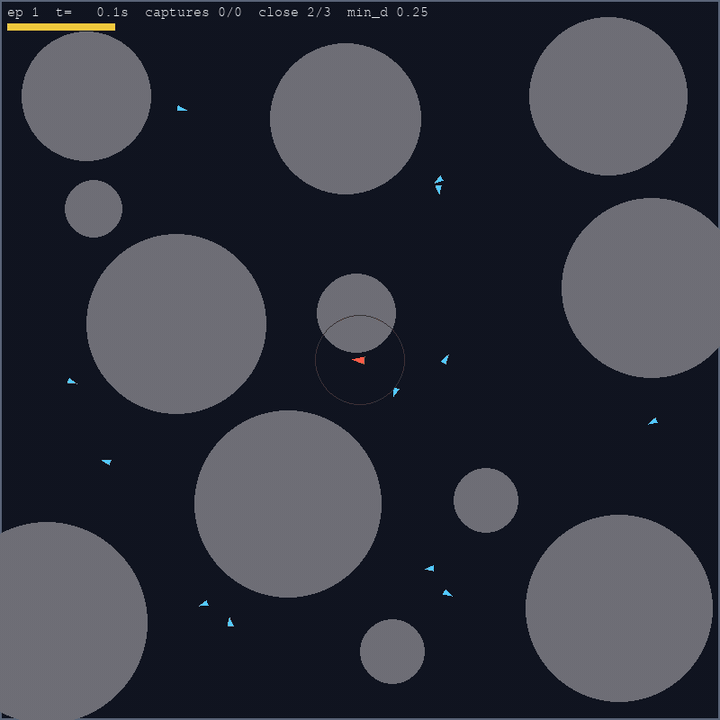
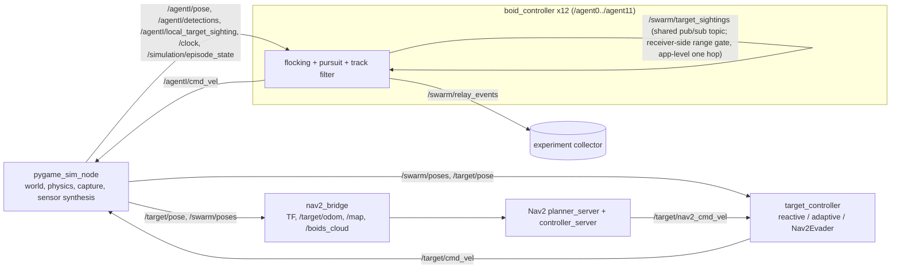
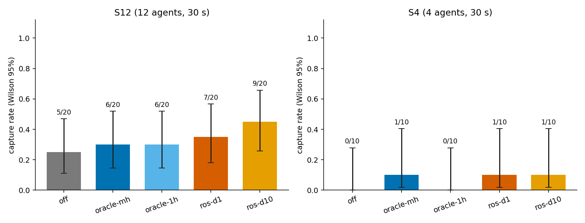
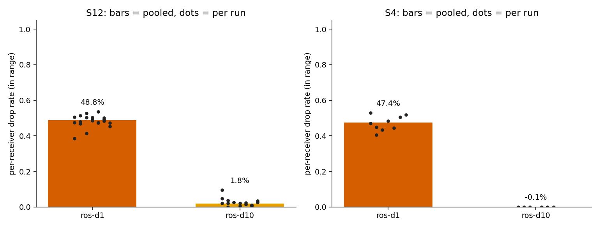

# Boids Swarm Pursuit: 12 ROS 2 nodes chasing a 1.8x-speed target

[](https://github.com/Jadiouo/boids-swarm-pursuit/actions/workflows/tests.yml)
[](LICENSE)

[中文舊版 README (legacy, English is authoritative)](docs/README.zh-TW.md) | [Version history and legacy details](docs/project-history.md)

A ROS 2 Jazzy + pygame sandbox where 12 boid drones try to catch a target that moves 1.8x faster than they do. Each boid is an independent ROS node. By default (the v3 baseline) it reads perfect poses; with `perception:=sensor sharing_mode:=ros` each agent has a simulated sensor (FOV, occlusion, noise) and shares sightings with the others over a ROS topic. The project's focus is not the chase itself but how that sharing works and how honestly it was measured.



*Single hand-picked recording, not a statistic: 12 agents, `encircle`, `env:=obstacle_field`, seed 11, target 1.8x (shipped `params.yaml`), perception=perfect; captured after about 9.7 s. Blue = pursuers, red = target. Reproduction: [docs/media/README.md](docs/media/README.md). Do not extrapolate a capture rate from it. The demo uses the default perfect-perception baseline, not the sensor+relay mode measured below.*

## Highlights

- **Sighting relay over ROS 2.** In `perception:=sensor` mode, one-hop `TargetSighting` topics built from each sender's simulated local sensor replace the simulator-side oracle, with range gate, freshness check, de-duplication and direct-over-relay arbitration. Developed in red→green slices with ROS integration tests ([SDD](SDD/Sdd_distributed_sighting_relay_v1.md), [TDD notes](docs/testing/distributed-sighting-relay-tdd.md)).
- **Pre-registered experiment** ([plan](SDD/Sdd_relay_phase2_prereg.md), unmodified; committed in the private development history about 7 min before the first run by local file timestamps; the author date is preserved on the first commit here; history was squashed before publication, so this is self-reported, not externally registered; per-run start/finish times are not part of the tracked artifacts). QoS `BEST_EFFORT depth=1` dropped 48.8% of in-range sightings per receiver (bootstrap 95% CI 48.0-49.7%); `depth=10` only 1.8% (1.3-2.4%), 12 agents ([E1](artifacts/relay-e1-2026-10-08/README.md)). Post-hoc [E1b](artifacts/relay-e1b-followup-2026-10-08/README.md): depth 1 still dropped about 52% in real time. Shipped default is now `shared_sighting_qos_depth: 10`.
- **Null result on capture.** Capture rate could not be distinguished between sharing modes at n=20 per cell (5/20 to 9/20, overlapping Wilson intervals); detecting 0.25 vs 0.45 would need about 89 runs per cell. So the experiment does **not** show that fixing the loss helps capture ([E1](artifacts/relay-e1-2026-10-08/README.md)).
- **Nav2 evader (M7).** This is the SDD v3 M7 integration work (TF, costmap, planner, controller on a non-Gazebo simulator); it does not claim a better evader. `evader:=nav2` uses a self-written `nav2_bridge` (TF, odom, occupancy map, boids as PointCloud2), Nav2 planner and RegulatedPurePursuit controller servers, no BT navigator. Planning failures went from 44% to 5% / 20% (two repeats of the same code) after a red-team fix round ([sanity](artifacts/nav2-m7-sanity/README.md), [tuning](docs/testing/nav2-mppi-tuning.md)).
- **Engineering practice.** Red-team review rounds ([review log](docs/planning/review-log.md)), pre-registration, a source fingerprint stored with every run, and an [artifacts index](artifacts/README.md) marking each folder as conclusion, diagnostic, exploration or voided. 261 collected pure tests and 15 real-process ROS integration tests.

## Architecture



Details and parameters: [package README](ros2_ws/src/boids_swarm/README.md).

## Results



Capture rate per mode (S12, 20 runs each, Wilson intervals): all five modes overlap, so no ordering is claimed. [Numbers and caveats](artifacts/relay-e1-2026-10-08/README.md).



Per-receiver in-range drop, the one clear pre-registered result: 48.8% at depth 1 vs 1.8% at depth 10 (fast-forward, time_scale 4). Likely mechanism (not tested): 12 publishers share one topic and the simulator publishes all of them in the same tick, so bursts overwrite the reader's KEEP_LAST(1) history before the executor takes them. In the post-hoc [E1b](artifacts/relay-e1b-followup-2026-10-08/README.md), depth 10 lost 7.7% under fast-forward (confounded by machine load) but 0.3% in real time, while depth 1 still lost about 52% in real time (4 runs per cell). Because of E1 the shipped default is now `shared_sighting_qos_depth: 10`; E1 and E1b set the depth explicitly and are unaffected. See also the exploratory [cumulative capture curve](docs/media/relay_e1_cumulative_capture.png) and the [artifacts index](artifacts/README.md).

## Quickstart

Needs ROS 2 Jazzy, Ubuntu 24.04, and pygame importable by `/usr/bin/python3`.

```bash
sudo apt install python3-pygame
scripts/quickstart.sh                  # build, pure tests, one headless 20 s episode (SKIP_ROS_TESTS=0 adds ROS tests)
source /opt/ros/jazzy/setup.bash && source ros2_ws/install/setup.bash
ros2 launch boids_swarm pursuit.launch.py num_agents:=12 env:=obstacle_field    # windowed demo with control panel
ros2 launch boids_swarm pursuit.launch.py perception:=sensor sharing_mode:=ros evader:=nav2 env:=obstacle_field   # ROS relay + Nav2 target (needs ros-jazzy-navigation2)
cd ros2_ws && PYTEST_DISABLE_PLUGIN_AUTOLOAD=1 python3 -m pytest -q             # 261 collected; without ROS sourced: 260 passed + 1 skipped
# ROS integration tests (15, real processes, minutes): source BOTH /opt/ros/jazzy/setup.bash and ros2_ws/install/setup.bash
# (workspace already colcon-built), otherwise the boids_swarm_msgs import fails
PYTEST_DISABLE_PLUGIN_AUTOLOAD=1 python3 -m pytest -q src/boids_swarm/ros_test
```

## Limitations

- World truth is still owned by a single simulator. The relay's range gate uses simulator poses; DDS itself delivers to every node. This is an application-level simulated range, not a radio model, and not a fully distributed system. There is no latency or loss model beyond QoS effects.
- The pre-registered n=20 per cell was fixed before any power calculation; a post-hoc calculation shows about 89 runs per cell are needed. 149 of the 150 E1 runs carry `working_tree_dirty`: a runner output-path bug created untracked directories, the source code did not change (see the [E1 README](artifacts/relay-e1-2026-10-08/README.md)).
- Runs are not bitwise reproducible with the same seed (the seed fixes layout only), so each run is one sample.
- All experiments ran on one shared machine under background load (load average 14-24 in E1, 13-68 in E1b). E1b's fast-forward vs real-time contrast is confounded with that load.
- E1 ran at `time_scale` 4; depth-1 loss was confirmed in real time only with 4 runs per cell (E1b, post-hoc).
- Capture-rate effects are undetermined (n=20); oracle and ros relays carry different information, so oracle is not an upper bound for ros.
- Nav2 target: pure Nav2 mode is only 9-22% of the time (the rest is blended or reactive near boids), in-game speed is lower than the reactive evader (1.9-2.4 vs 2.7-2.9 m/s), Nav2 does not react to boids itself, and self-trapping in a wall pocket is reduced but not solved (seed 6, 15 plan failures in one repeat). The sanity run is not an experiment: two repeats of identical code disagreed more than the evaders differed.
- The shipped target speed is 1.8x, not 2x (2x plus stamina was measured as impossible rather than hard).

## Repo map

| Path | Contents |
|---|---|
| [SDD/](SDD/) | Design documents (v2/v3/v4), relay SDD, pre-registration |
| [docs/](docs/) | [testing notes](docs/testing/), [media](docs/media/), [planning](docs/planning/), [project history](docs/project-history.md) |
| [artifacts/README.md](artifacts/README.md) | Index of every experiment folder and its status |
| [ros2_ws/src/boids_swarm/](ros2_ws/src/boids_swarm/) | Main package: nodes, `behaviors/`, launch, `tools/` experiment runners, tests |
| [scripts/quickstart.sh](scripts/quickstart.sh) | One-shot build and verification |
| [log.md](log.md) | Chronological development log and pitfall list |
