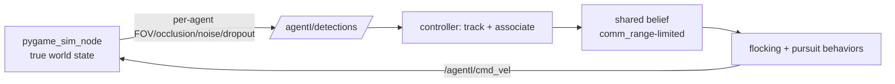

# Software Design Document (SDD) — v4
## Project: ROS 2 Boids Swarm — Perception Model, Advanced Cooperative Control & Procedural Environments

> **Revision note (v4).** Builds on **v2** (Boids core: separation/alignment/cohesion/boundary/wander + non-holonomic conversion) and **v3** (pygame simulator, pursuit game, strategies T0–T4), both implemented and passing (40 tests; aggregated `/swarm/poses` broadcast; strategy-pattern pursuit/evasion; seeded, bounded-`time_scale`, headless benchmarking). v4 is motivated by two findings from v3 playtesting:
> 1. **The untiring 2× target survives by hugging the perimeter.** A fast evader on a clean closed loop reduces 2D pursuit to a 1D chase — slower pursuers can't overtake and the wall denies the far side — so it is *mathematically* safe. Weight-tuning can't beat a safe strategy; the fix is tactics that attack the loop and environments that deny it.
> 2. **The current perception is unrealistic and hides the individual-vs-swarm distinction.** The sim broadcasts full ground-truth pose to everyone and each agent just masks by radius `R`. There is no field of view, occlusion, noise, or dropout, and the target is globally visible. There is no situation where the *group* knows something an *individual* doesn't — which is exactly what makes swarms interesting.
>
> v4 addresses both. Each section notes which existing v3 module it touches. Everything ships behind a toggle against the v3 baseline so existing benchmarks stay comparable.

**v4 contents:**
- **Part A** — Perception & Sensor Model (the piece deferred from v3)
- **Part B** — Advanced Cooperative Control (defeating the perimeter loop)
- **Part C** — Procedural Environments (denying the clean loop)
- **Part D** — Adaptive Target (arms race)
- **Part E** — Development Roadmap (M8–M14, for Claude Code)

---

## Part A — Perception & Sensor Model

**A.1 The problem being fixed.** Today the sim (sole world-owner) publishes the full true-pose array on `/swarm/poses` (30 Hz); each controller reads all of it and keeps neighbors with `distance < R`. That is simulated local *behavior* on global *data*: no FOV, no occlusion, no noise, no missed detections, and the target is always known to every boid. It cannot produce search, information gaps, or emergent information-sharing, and it is the least faithful part of the model versus real drones (onboard, limited, noisy, relative sensing).

**A.2 Design principle — synthesize sensing in the sim, per agent.** Because the sim already knows every true state, it computes *what each agent can actually detect* and publishes only that. This **replaces the `/swarm/poses` broadcast**. The O(N²) visibility geometry is done **once, vectorized, in the one sim process** (cheap for N≈12–20), and each controller then subscribes to just its **own** short detection stream — fewer subscriptions than today's broadcast *and* realistic.

**A.3 Sensor components** (each a parameter, so any component can be ablated independently):

| Component | Behavior | Parameter(s) |
|---|---|---|
| Field of view | Sense only within a cone of half-angle `fov` about heading, out to `sensor_range` (set `fov=π` for omni) | `fov`, `sensor_range` |
| Occlusion | Ray-cast sensor→candidate; if an obstacle or another agent's body blocks the ray, the candidate is hidden (vectorized segment intersection) | `occlusion_enabled`, `agent_body_radius` |
| Noise | Additive Gaussian on measured range & bearing, **growing with distance** (far = noisier) | `range_sigma`, `bearing_sigma` |
| Missed detections | Per-detection dropout probability, optionally rising with range | `p_miss` |
| Relative frame | Detections are **relative range + bearing** in the agent's own frame — never absolute world XY | (inherent) |
| Identity ambiguity (optional) | Detections may be **unlabeled** → controller must associate blips across frames | `emit_ids` |

**A.4 Interface change (what the sim publishes).**
- `/agent{i}/detections` — a variable-length list of `[range, bearing, (id?), is_target?]`. Encode as a small custom `Detections.msg`, or as a `Float32MultiArray` with a fixed stride. Each controller subscribes to **only its own**.
- **The target is folded into the same sensing.** A boid knows the target's position *only* when the target is inside its cone, within range, and unoccluded. There is **no more global `/target/pose` for the boids** (the sim still tracks the true target for physics and scoring).
- **Migration:** deprecate the aggregated `/swarm/poses` broadcast; controllers move from "read full array + mask by `R`" to "read own detections."

**A.5 Controller-side: a new perception → tracking layer.**
- Convert relative detections to world estimates using the agent's own pose (add own-pose/odometry noise here if you want drift).
- **Track filter + data association:** maintain a short-lived track per detected neighbor — nearest-neighbor association across frames plus a simple per-track filter (alpha-beta, or a small constant-velocity Kalman) — to smooth noise and bridge dropouts. This is what real swarms do, and it protects the steering loop (v3 M2 bug #2: noisy/absent neighbor data made the P-controller oscillate at the ±π wrap).
- Feed **tracked** neighbor estimates — not raw noisy blips — into the flocking and pursuit behaviors.

**A.6 What this unlocks (why individual-vs-swarm becomes real).**
- **Search behavior** (new module): when *no* boid can currently see the target, the swarm must search — a coverage/wander sweep until reacquisition — rather than magically knowing where it is.
- **Information sharing** (the emergent cooperation): a boid that sees the target broadcasts the sighting; others relay it (mesh gossip), so the swarm collectively tracks a target most individuals cannot see. This is genuine swarm behavior (radio/mesh sharing) and is the moment the individual-vs-swarm distinction appears: **the group holds knowledge no single agent has.** Model comms as another sim-mediated "sensor" — agent *i* hears agent *j* only within `comm_range` — keeping the decentralized-with-local-links theme consistent (and letting you turn comms off to *show* the gap).
- **Tactics run on beliefs, not truth:** every detector in Part B ("is it circling?", "which corner next?") runs on the **shared/tracked** target estimate, and degrades gracefully to search under heavy dropout.

**A.7 Development discipline.** Gate everything behind a `perception_mode` parameter: `perfect` (current v3 behavior — keep as baseline/regression) vs `sensor` (new). Ship both. Ablate each component (`fov` / `occlusion` / noise / `p_miss`) independently.

---

## Part B — Advanced Cooperative Control (defeating the perimeter loop)

New pursuit/formation strategies slot into the existing `behaviors/pursuit.py` strategy pattern, selected by `pursuit_strategy`. All circling detectors run on the shared/tracked target belief (Part A), so test every tactic in **both** `perfect` and `sensor` perception modes.

**B.1 Counter-rotation pincer (`counter_rotate`).** Detect circling (target track moving tangentially along a wall for sustained time, with a consistent angular direction about arena center). Split the swarm: rear boids keep chasing; a subset traverses the perimeter the **opposite** way to meet the target head-on. On a closed loop the counter-rotating interceptor is guaranteed to meet it, forcing a dilemma — reverse (into the rear chasers → pincer) or cut inward (off the wall → 2D encirclement, which the swarm already wins). Decentralized: each boid picks its role from its own position relative to the target's circling direction.

**B.2 Interpose-and-wait / chokepoint blockade (`blockade`, evolves T1).** T1 aims at the predicted position and *re-chases* when the target turns. Instead, on detecting circling, extrapolate the target's 1D wall-track **far** ahead and assign 1–2 boids to **arrive early and hold station** as a stationary plug — 2× speed is irrelevant against a stationary blockade in front, the target runs into it. Needs: circling detector + track extrapolation + station-keeping (arrive, stop, hold — do **not** chase).

**B.3 Corner trap (`corner_trap`).** Exploit the target's turn radius `r_min ≈ v/ω_max ≈ 4/1.2 ≈ 3.3` (matches the v3 log): it cannot hug a sharp corner and must swing wide into the interior or slow down. Predict the next corner on its circling path, pre-stage boids in the corner interior, and close as it swings wide. Complements B.1/B.2.

**B.4 Inverted herd (`herd_inward`, fixes T4).** Current T4 herds the target *toward* walls — counterproductive against a wall-hugger. Add the inverse: approach from the wall side and push the target **off** the wall into the open center, where encirclement works. Parameterize herd direction (toward-wall vs toward-center) so both exist.

**B.5 Sweep / cordon line (`sweep`).** A new formation, not a ring: a line of boids **anchored at both ends to walls**, advancing in one direction to shrink the target's reachable region (the pursuit-evasion "clearing"/sweeping idea). Because the ends touch walls, the target can't slip around them; it gets pinned to a corner. Different paradigm from encircle — shrink the space rather than surround a point — and strong specifically against perimeter runners.

**B.6 Role-differentiated ring (enhances T3 encircle).** Instead of uniform ring spacing, **anchor** the boid on the side the target is fleeing toward (it holds/blocks) while rear boids **accelerate** to close — an asymmetric collapse that captures faster than equal spacing.

**B.7 Bait (`bait`, optional/advanced).** Deliberately open a lane in the encirclement to steer the target toward a prepared kill-box (or a Part C capture zone). Emergent and high-skill; keep behind a flag.

**B.8 Degradation under partial observation.** When the shared belief is stale (target unseen by all), tactics fall back to search (A.6) rather than committing to a bad blockade. Validate in `sensor` mode, not just `perfect`.

---

## Part C — Procedural Environments (denying the clean loop)

Environments must be **strategically meaningful** — break the perimeter loop and create chokepoints, not just add visual variety. All layouts are **seed-derived** so strategy benchmarks stay fair (consistent with v3 methodology). New generator: `world_gen.py`; sim support added in `pygame_sim_node.py`.

**C.1 Loop-breaking obstacle fields (`obstacle_field`).** Poisson-disk-distributed obstacles, with some placed **near walls to sever the clean perimeter** and form bottlenecks. Gap widths tuned so boids fit (`agent_body_radius`) but the larger/faster target must detour → natural chokepoints where 1–2 boids suffice. Reuses the existing boid `V_obs` repulsion and obstacle rendering/collision from v3 M6.

**C.2 Capture zones / tar pits (`zones`).** Regions that **nullify the target's 2× advantage** on entry (or count as capture). This repurposes the existing herd machinery into a direct win condition — herd the target into the pit. New sim feature: speed-modifying regions + a zone-based win check. (Also opens "safe zone" / "hazard zone" variants for later modes.)

**C.3 Arena topology variety (`arena_shape`).** Central pillar (the target can circle it, but a *smaller* loop is far easier to blockade), interior walls/partitions (shatter the single big loop into segments), non-rectangular boundaries. Requires sim support for interior wall segments + rendering; boid `V_obs` and the sensor occlusion (A.3) already generalize to segment obstacles.

**C.4 Shrinking arena (`shrink_arena`) — top-recommended rule-level fix.** The playable bounds contract over the episode (battle-royale style); the perimeter loop shortens until `r_min` (3.3) no longer fits, so circling becomes **physically impossible**, and every episode is guaranteed to terminate. Pairs naturally with stamina. Implementation is cheap: animate the boundary inward at `shrink_rate`; the v2 §4.3.4 boundary-avoidance already handles a moving wall; add an out-of-bounds penalty/damage. Highest impact for least code.

**C.5 Seeded generation + benchmarking.** `WorldGenerator(seed)` deterministically emits the full layout (obstacles, zones, walls, spawn points). Log the seed with each `EPISODE`/`SUMMARY` line (existing format) so comparisons run on identical maps. Extend the headless bounded-`time_scale` harness to sweep `{strategy × env_type × seed}`.

---

## Part D — Adaptive Target (arms race)

**D.0 Rationale.** Hard-countering "circle the wall" just pushes the target to the next exploit. A utility-based behavior selector makes the game an arms race rather than whack-a-mole, and gives more realistic adversarial dynamics. Lives in `behaviors/evasion.py`.

**D.1 Behavior repertoire** (each is cheap or already partly present): perimeter-run (current), juke/dodge (sharp evasive turn when a pursuer is within panic distance — uses existing stamina sprint), obstacle-shield (keep an obstacle between itself and the nearest cluster — synergizes with Part C), gap-dash (sprint through a boid-sized gap the swarm can't cleanly follow), retreat-to-open (flee toward the lowest pursuer-density region — the existing ReactiveEvader core).

**D.2 Selector.** Each cycle, score behaviors by expected survival utility given threat geometry (nearest-pursuer distance, encirclement completeness, distance to walls/obstacles/gaps, stamina) and pick the argmax **with hysteresis** to avoid dithering. Keep it an interpretable weighted heuristic, **not** a learned policy — easier to tune and debug, consistent with the project's transparent-control philosophy.

**D.3 Difficulty knobs.** Repertoire size, panic distance, planning horizon, stamina economy — tune target strength to keep capture "possible-but-hard" (the v3 §4.2 standard) across the whole tactic suite.

**D.4 Nav2 tie-in (optional).** The retreat-to-open / obstacle-aware behaviors can later delegate to the `Nav2Evader` stub (v3 M7) for genuinely planned obstacle-avoiding flight in complex arenas — the arms race finally gives Nav2 a real job.

**D.5 Note.** With an adaptive target *and* partial-observation pursuers, two learning-free adaptive systems are now in tension — a good sandbox for the eventual real-drone question, and a genuinely replayable game.

---

## Part E — Development Roadmap (for Claude Code)

**E.0 Where it slots in** (existing `boids_swarm` package from v3):
- `behaviors/pursuit.py` — new strategies (B.1–B.7)
- `behaviors/evasion.py` — adaptive selector (Part D)
- `pygame_sim_node.py` — sensor synthesis, zones, shrinking bounds, interior walls
- **new** `perception.py` — sim-side sensor model (A.3–A.4)
- **new** `tracking.py` — controller-side track filter + data association (A.5)
- **new** `comms.py` — information sharing (A.6)
- **new** `world_gen.py` — procedural layouts (Part C)

Keep the v3 discipline: strategy pattern for behaviors; `perception_mode` (perfect baseline) and seed-deterministic worlds throughout; executor-in-background-thread + QoS-depth-1 for the sim (v3 bug #3); single-threaded pygame loop.

**E.1 Milestones** (ordered; each ends runnable, carries the perfect-vs-sensor A/B and seeded benchmarks, and has explicit acceptance criteria):

| # | Goal | Key deliverables | Done when |
|---|---|---|---|
| **M8** | Sensor model | `perception.py`: per-agent FOV/occlusion/noise/dropout, relative coords; `/agent{i}/detections`; controller conversion; `perception_mode` | `perfect` mode reproduces v3 metrics (regression holds); `sensor` mode: agents react only to in-cone/unoccluded neighbors; each component ablates as expected; boids lose the target when it leaves all cones |
| **M9** | Tracking + degradation | `tracking.py` (filter + association); **search** behavior when target unseen | Flocking stays stable under noise/dropout (min-distance, hvar within tolerance of perfect); on losing the target the swarm searches and reacquires |
| **M10** | Information sharing | `comms.py`: sighting broadcast/relay, optional `comm_range` | A target seen by ≥1 boid is tracked by the whole swarm; with comms off, only in-cone boids react (demonstrates the individual-vs-swarm gap) |
| **M11** | Anti-perimeter tactics | `counter_rotate`, `blockade`, `corner_trap`, `herd_inward`; circling detector on shared track | On the open arena vs the perimeter-hugging target, these clearly beat the v3 T0–T4 capture rates on the same seeds |
| **M12** | New formations | `sweep` (wall-anchored line); role-differentiated encircle; optional `bait` | Sweep pins the target to a corner; asymmetric encircle captures faster than the uniform ring |
| **M13** | Procedural environments | `world_gen.py`: obstacle fields w/ chokepoints, capture zones, interior walls, shrinking arena; seed-logged | Shrinking arena forces capture within bounded time even against the best evader; chokepoints let small blockades work; layouts reproduce from seed |
| **M14** | Adaptive target | Utility-based selector + repertoire (Part D) | Target switches behaviors sensibly (logged mode changes tied to threat geometry); tuned to "possible-but-hard" across the tactic suite; no single dominant open-arena exploit remains |

**E.2 Testing / metrics** (extend the v3 harness). Add per-run logging of: perception mode, env seed/type, target behavior distribution, **target-visibility fraction** (how often ≥1 boid sees it), **search-time fraction** — alongside existing capture time / boids lost / min pairwise distance / heading variance. Sweep `{perception_mode × strategy × env_type × seed}`. Keep bounded `time_scale` + `/clock` + `use_sim_time` fairness.

**E.3 Integration risks** (v3 lessons carried forward + new):
1. **Sensor noise/dropout stresses the P-steering + EMA loop** (compounds v3 M2 bug #2). Lean on the `tracking.py` filter; expect to re-tune EMA/hysteresis.
2. **Per-agent detection topics:** N topics but **1 subscription each**; keep the background-thread executor + QoS-depth-1 discipline (v3 bug #3).
3. **Tactic detectors depend on shared-track quality** — validate in `sensor` mode, not only `perfect`.
4. **Procedural layouts must be seed-deterministic**, or策略 benchmarks become noise.

**E.4 Stretch.** Activate `Nav2Evader` (v3 M7 contract: odom/TF/OccupancyGrid/escape-goal loop) for adaptive obstacle-aware flight (D.4).

---

## Closing note

With a real sensor model, information-sharing, and an adaptive adversary, the sandbox now genuinely exercises the **local-perception → collective-behavior** gap that the eventual Crazyflie migration hinges on — and it's where the individual-vs-swarm character finally shows. The `perception_mode: perfect ↔ sensor` toggle is both the regression guard for this work and the bridge for validating the hardware transition later.