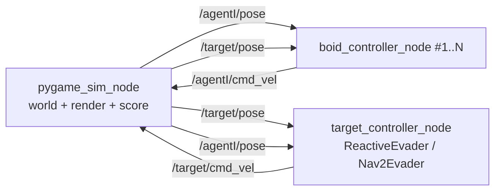

# Software Design Document (SDD) — v3
## Project: ROS 2 Boids Swarm — Cooperative Pursuit Game (pygame display + ROS 2 core)

> **Revision note (v3).** Two big changes from v2:
> 1. **Display layer switched from turtlesim to pygame**, while keeping the ROS 2 core. A new `pygame_sim_node` takes over turtlesim's old role (owns world physics + rendering + pose publishing). Because it plays the exact same role, the boid controllers from v2 are unchanged. Side effect: agent size/shape and trajectory trails are now fully under our control (this resolves the earlier "shrink the turtle / no pen line" limitations, which were turtlesim-only).
> 2. **New control layer: a cooperative pursuit game** — the swarm must catch a target that moves at **2× swarm speed**, which is mathematically impossible for any single agent and therefore *forces* cooperation. This document records the full ladder of cooperative tactics, the capture/scoring rules, the target's evasion AI (including an honest analysis of using **Nav2**), and a milestone-based development roadmap intended to be executed by Claude Code.
>
> v2 (`sdd_boids_turtlesim_v2.md`) still holds for the internal rationale of the core Boids rules (Separation / Alignment / Cohesion / Boundary / Wander) and the non-holonomic kinematic conversion. This document restates them compactly so it is self-sufficient for implementation, and references v2 for the "why".

---

### 1. Architecture Update — ROS 2 retained, pygame as simulator + display

The decentralized per-agent design is unchanged: each boid runs its own controller node in its own namespace. What changes is the world/display layer.

**1.1 The pygame simulator node replaces turtlesim.** In v2, turtlesim owned the world: it integrated velocities into positions, rendered, and published poses. `pygame_sim_node` now does exactly that. Because the controllers only ever talked to the world through `pose` (in) and `cmd_vel` (out), swapping the world implementation does not touch them.

**1.2 Node inventory (v3)**

| Node | Count | Responsibility |
|---|---|---|
| `pygame_sim_node` | 1 | **The world.** Subscribes to every `cmd_vel`, integrates physics (non-holonomic by default), detects collisions/capture, renders everything in pygame, publishes every `pose`, draws the HUD/score. For the Nav2 target it additionally publishes odometry + TF + an occupancy map. |
| `boid_controller_node` | `N` | Per-agent flocking **+ pursuit** behavior (§3–4). Unchanged pub/sub contract from v2. |
| `target_controller_node` | 1 | The evader. Pluggable brain: `ReactiveEvader` (default) or `Nav2Evader` (§6). |

> Spawning is now internal: `pygame_sim_node` reads `num_agents` from a parameter and creates the agents itself. The v2 `/spawn` and `/kill` services are no longer required (they were turtlesim services). Keep a ROS-triggered spawn only if you later want to add/remove agents at runtime.

**1.3 Message types (no custom message package needed).**
- Agent pose: reuse **`turtlesim/msg/Pose`** — it carries `x, y, theta, linear_velocity, angular_velocity`, which is exactly what the controllers already consume, so they need zero changes. (Cost: a build dependency on `turtlesim` purely for the message. Swap to a small custom `AgentState.msg` later if you want to drop that dep.)
- Commands: **`geometry_msgs/msg/Twist`** (linear.x, angular.z).
- Target under Nav2 (M7 only): additionally **`nav_msgs/msg/Odometry`** + **TF** (`map → odom → base_link`) + **`nav_msgs/msg/OccupancyGrid`** for the static obstacle map.

**1.4 Topics**

| Topic | Type | Dir (from node) |
|---|---|---|
| `/agent{i}/pose` | `turtlesim/msg/Pose` | sim → controllers |
| `/agent{i}/cmd_vel` | `geometry_msgs/msg/Twist` | controllers → sim |
| `/target/pose` | `turtlesim/msg/Pose` | sim → boids (so they can chase) & target brain |
| `/target/cmd_vel` | `geometry_msgs/msg/Twist` | target brain → sim |
| `/target/odom`, `/tf`, `/map` | Nav2 types | sim → Nav2 (M7) |



**1.5 pygame + rclpy integration (important gotcha for implementation).**
Only `pygame_sim_node` mixes the two event loops. Use **one single-threaded loop** — simplest and deterministic:

```python
rclpy.init()
node = PygameSimNode()          # declares params, creates subs/pubs, builds world
clock = pygame.time.Clock()
while rclpy.ok() and node.running:
    rclpy.spin_once(node, timeout_sec=0.0)   # drain incoming cmd_vel
    dt = clock.tick(node.fps) / 1000.0
    node.handle_pygame_events()              # quit, keyboard (human-target mode)
    node.step_physics(dt)                    # integrate all agents + target
    node.check_capture_and_score()
    node.publish_states()                    # publish every pose (+odom/tf for target)
    node.render()
node.destroy_node(); rclpy.shutdown()
```

The controller nodes (`boid_controller_node`, `target_controller_node`) are **separate processes** launched via a launch file; each is a normal rclpy node driven by its own fixed-rate timer (§v2 4.1: decouple sensing from control). Do **not** put pygame in them.

---

### 2. Motion Model

Configurable per entity; **non-holonomic by default** (keeps the v2 kinematic-conversion work relevant, and turn-rate limits are what make the game winnable — see §4.2).

- **Non-holonomic (default):** command is (v, ω); integrate `θ += ω·dt`, `x += v·cos θ·dt`, `y += v·sin θ·dt`. Controllers convert their desired velocity vector to (v, ω) using the v2 §4.5 conversion (atan2 target heading, P-controller on heading error, `forward = max(0, cos e_θ)` to forbid reversing, clamp v and ω).
- **Holonomic (optional, drone-accurate):** command is a 2D velocity directly; no steering layer. Closer to a quadrotor's horizontal motion, and where the project eventually heads for hardware — offer it as a `motion_model` parameter but ship the game on non-holonomic.

---

### 3. Boids Control Layer (consolidated; full rationale in v2 §4)

Each control cycle a boid selects neighbors within sensing radius `R`, then sums weighted behavior vectors. `p`=position, `θ`=heading, subscript `s`=self, `i`=neighbor.

| Behavior | Vector | Notes |
|---|---|---|
| Separation | $\vec{V}_{sep}=\sum_{d_i<d_{safe}}\frac{\vec{p}_s-\vec{p}_i}{d_i^2}$ | repel from too-close neighbors; usually the largest weight |
| Alignment | $\vec{V}_{align}=\frac{1}{|N|}\sum_i(\cos\theta_i,\sin\theta_i)$ | **average headings as unit vectors** (never average raw angles — they wrap at ±π; v2 §4.3.2) |
| Cohesion | $\vec{V}_{coh}=\big(\frac{1}{|N|}\sum_i\vec{p}_i\big)-\vec{p}_s$ | steer to neighborhood centroid |
| Boundary | inward push inside soft margin | keeps swarm off walls (v2 §4.3.4) |
| Wander | random-walk heading when `|N|=0` | prevents lone agents freezing |
| **Pursuit** | **§4** | **new — the chase term** |

$$\vec{V}_{desired}=w_{sep}\vec{V}_{sep}+w_{align}\vec{V}_{align}+w_{coh}\vec{V}_{coh}+w_{bound}\vec{V}_{bound}+w_{wander}\vec{V}_{wander}+w_{pursuit}\vec{V}_{pursuit}$$

All weights and radii are ROS 2 parameters, runtime-reconfigurable via `add_on_set_parameters_callback` (v2 §5).

---

### 4. Cooperative Pursuit & Whole-Swarm Control (the new core)

**4.1 Why 2× target speed is the design engine.**
If the target moves at twice the swarm's max speed, **no single boid can ever catch it by direct pursuit** — a stern chase is a losing chase. This is intentional: it makes brute-force "everyone charge the target" fail, and makes *cooperation* the only winning strategy — prediction, flanking, encirclement, and herding into corners. "Deepening whole-swarm control" and "the 2× target" are the same lever.

**4.2 Target constraints that make it catchable (do this or the game is unwinnable/unfun).**
- **Non-holonomic + turn-rate limit `target_ω_max`.** "Fast but turns badly." This is the crucial balance knob: a fast-but-sluggish-turning target *can* be out-angled, predicted, and herded; a target that is both 2× fast and can pivot instantly is essentially uncatchable. Tune `target_ω_max` down until capture is possible-but-hard.
- **Optional stamina/sprint.** 2× speed only while stamina lasts; sprinting drains it, coasting refills. Gives the swarm windows to close in and adds risk/reward for the target.

**4.3 Target evasion AI.**
- **Reactive baseline (`ReactiveEvader`, ship first):** flee the swarm centroid (reverse-Boids), bias toward the **lowest-density direction** (escape through the biggest gap between pursuers), plus wall avoidance. Simple, fast, no external deps.
- **Nav2 option (`Nav2Evader`, M7):** intelligent obstacle-aware fleeing — see §6.

**4.4 Cooperative pursuit tactics — an implementable ladder.**
Implement each as a swappable **pursuit strategy** (strategy pattern) selected by a `pursuit_strategy` parameter, so you can A/B them and watch the swarm's success rate climb. Presented in escalating order:

- **T0 — Naive pursuit (baseline, expected to FAIL):** every boid aims `\vec{V}_{pursuit}` at the target's *current* position. Build this first specifically to demonstrate the 2× problem — the swarm forms a hopeless tail. It is the control experiment.

- **T1 — Predictive interception (lead pursuit / proportional navigation):** aim at the target's *predicted future* position, `\vec{p}_{target}+\vec{v}_{target}\cdot t_{lead}`, where `t_lead` scales with distance/closing speed. One change and the swarm naturally fans out to cut angles instead of trailing. Biggest single improvement; do this right after T0.

- **T2 — Pincer / role assignment:** split the swarm into **chasers** (drive from behind) and **interceptors** (loop ahead to cut off escape). Fully decentralized decision rule: project the boid's relative position onto the target's velocity vector — boids *ahead* of the target become interceptors, boids *behind* become chasers. Produces emergent flanking with no central coordinator.

- **T3 — Encirclement ring (visually the payoff):** each boid claims an **angular slot** on a ring around the target and aims at `\vec{p}_{target}+r(\cos\phi_i,\sin\phi_i)`; the ring radius `r` **shrinks over time**. Boids detect the largest *gap* on the ring and fill it first, so the net closes evenly. Emergent, pretty, and not hard to code. Slot assignment can be decentralized (each boid picks the nearest unclaimed slot, broadcasting its claim, or deriving slots deterministically from agent index).

- **T4 — Herding / cornering:** don't try to capture in the open; deliberately approach from **one side only** to drive the target toward a wall, corner, or trap zone, then collapse the ring. This weaponizes the target's own "flee-from-swarm" instinct against it. Strongest combined with T3.

**4.5 Capture condition (since no boid can physically touch a 2× target).**
Define capture by **containment**, not contact. Options (choose one, expose as `capture_mode`):
- **Convex-hull:** target lies inside the convex hull of ≥ `k` boids, all within distance `d_capture`. Clean and matches "surrounded".
- **Escape-blocked:** sample escape directions around the target; capture when *all* are blocked by a boid within `d_capture`.
- **Health/tag (optional):** target has HP; a boid within `d_capture` tags it (drains HP). Single boids can't sustain tags because the target outruns them, so cutting off retreat is still required.

**4.6 Scoring.** `time_to_capture` (primary), `boids_lost` (if collisions/obstacles remove agents), `path_efficiency`. Show live on the HUD.

**4.7 Game modes (`game_mode` parameter).**
- **`ai`** — target runs `ReactiveEvader`/`Nav2Evader`. For tuning and benchmarking tactics.
- **`human`** — a person drives the 2× target with keyboard/gamepad (pygame captures input in the sim node) and tries to evade the swarm. This is the most fun mode and the best way to *feel* whether the cooperative tactics actually work; it also connects to the leader/teleop idea from v2 §9.

---

### 5. Parameters (new/changed in v3; carry v2 §5 for the flocking ones)

| Parameter | Meaning | Start |
|---|---|---|
| `num_agents` | swarm size `N` | 12 |
| `motion_model` | `nonholonomic` \| `holonomic` | nonholonomic |
| `agent_max_speed` | swarm linear speed cap | 2.0 |
| `target_speed_multiplier` | target speed ÷ swarm | 2.0 |
| `target_omega_max` | target turn-rate cap (the balance knob) | 2.5 |
| `target_stamina_enabled` / `_drain` / `_regen` | sprint model | off |
| `w_pursuit` | pursuit weight in the sum | 1.5 |
| `pursuit_strategy` | `naive`\|`intercept`\|`pincer`\|`encircle`\|`herd` | intercept |
| `lead_time` (`t_lead`) | interception prediction horizon | 1.0 |
| `ring_radius_start` / `ring_radius_min` / `ring_shrink_rate` | encirclement schedule | 3.0 / 0.8 / 0.2·s⁻¹ |
| `capture_mode` | `hull`\|`escape_blocked`\|`tag` | hull |
| `capture_k` / `d_capture` | containment thresholds | 3 / 1.5 |
| `game_mode` | `ai`\|`human` | ai |
| `obstacles` | list of obstacle geometries | [] |
| `render_trails` | draw motion trails | false |
| `agent_radius_px` | drawn agent size | 6 |

---

### 6. Nav2 for the Target — honest analysis + design

**6.1 The verdict.** Nav2 is a **goal-directed** navigator (plan a path to a fixed pose, avoid mapped/sensed obstacles, follow it). Pure evasion has **no fixed goal** — the objective is "away from pursuers", changing every frame — and Nav2's behavior-tree + global-planner latency (~1 Hz global replan) fights a target that must react continuously to fast pursuers. **In an open arena, Nav2 is overkill and a worse behavioral fit than a reactive potential field** (`ReactiveEvader`); even A* is more than you need there.

**6.2 When Nav2 becomes the right call.** Add **obstacles**, and the picture flips. A purely reactive evader runs itself into dead-ends (which the swarm exploits — arguably too easily). A **Nav2-planned** evader routes intelligently around obstacles toward open space and avoids self-trapping, becoming a genuinely worthy adversary. You then get a compelling asymmetry — **global-planning evader vs. reactive-swarm pursuers** — and you exercise the exact tooling your team is already using. This is not "A* but heavier"; it is a different, defensible design.

**6.3 Recommended design — pluggable target brain.** Put the target's brain behind a strategy interface:
- `ReactiveEvader` (default, ship first): reverse-Boids + gap-seeking + wall avoidance. Gets a playable game running immediately and is what you tune the cooperative tactics against.
- `Nav2Evader` (M7, once obstacles exist): satisfies the Nav2 learning goal without rearchitecting.

**6.4 What `Nav2Evader` needs from `pygame_sim_node` (the plumbing you'll build/learn):**
- **TF**: `map → odom → base_link` for the target; **odometry** on `/target/odom`.
- **Costmap inputs**: publish the static walls/obstacles as a `nav_msgs/OccupancyGrid` (`/map`), consumed by Nav2's static layer; feed the **boids as dynamic obstacles** into the local costmap (e.g. synthesize a `LaserScan`/`PointCloud2` from boid positions for the obstacle layer, or write a small custom costmap layer).
- **Velocity limits**: set Nav2's controller max velocity to the 2× target speed.
- **Escape-goal loop**: compute an escape pose each cycle (opposite the swarm centroid / toward the largest gap / toward the nearest open region) and drive the target there. Because full global replanning every frame is too slow, prefer leaning on Nav2's **costmap + local controller** (e.g. MPPI/DWB) toward a moderately-updated escape goal for obstacle-aware fleeing, and **blend a fast reactive term** between updates so the target stays responsive to closing pursuers.

**6.5 Caveat.** Nav2 APIs and the exact costmap-layer/controller config evolve between distros — confirm specifics against your installed Nav2 version (Claude Code should verify current interfaces rather than assume). Treat §6.4 as the design contract; the wiring details are a configuration exercise (and a good chunk of the learning value).

---

### 7. Development Roadmap (for Claude Code)

**7.1 Package layout** (ROS 2 `ament_python`):

```
boids_swarm/
├── package.xml                     # deps: rclpy, geometry_msgs, turtlesim; (M7) nav2_*, nav_msgs, tf2_ros
├── setup.py                        # entry_points for the 3 nodes
├── boids_swarm/
│   ├── pygame_sim_node.py          # world + render + pose/odom pub + cmd_vel sub + score
│   ├── boid_controller_node.py     # flocking + pursuit (per agent)
│   ├── target_controller_node.py   # evader; selects Reactive/Nav2 brain
│   ├── geometry.py                 # vec math, angle wrap/normalize, unit-vector heading average
│   ├── behaviors/
│   │   ├── flocking.py             # sep / align / coh / boundary / wander
│   │   ├── pursuit.py              # naive | intercept | pincer | encircle | herd
│   │   └── evasion.py              # ReactiveEvader; Nav2Evader adapter
│   └── game.py                     # capture condition, scoring, HUD state
├── launch/
│   ├── flocking.launch.py          # M2: sim + N boids (no target)
│   ├── pursuit.launch.py           # M3+: sim + N boids + target
│   └── nav2_target.launch.py       # M7: brings up Nav2 for the target
├── config/
│   ├── params.yaml                 # all tunables (§5 + v2 §5)
│   └── nav2_target.yaml            # Nav2 params (M7)
└── maps/arena.{yaml,pgm}           # static obstacle map for Nav2 (M7)
```

**7.2 Design rules for the implementation (state these to Claude Code):**
- `pygame_sim_node` is the **sole owner of world state**; controllers never share memory with it, only ROS topics.
- Pursuit and evasion are **strategy objects** selected by parameter — adding/swapping a tactic must not touch the sim or the controller scaffolding.
- Sensing (pose callbacks → cache) is **decoupled** from control (fixed-rate timer). Never run the algorithm in a pose callback.
- Every tunable is a **declared ROS 2 parameter** with a runtime reconfigure callback.
- Single-threaded pygame+rclpy loop in the sim node (§1.5); pure-rclpy timer loops in the controllers.

**7.3 Milestones — each ends in something *runnable*, with acceptance criteria Claude Code can self-check.**

| # | Goal | Key deliverables | Done when (acceptance) |
|---|---|---|---|
| **M0** | Skeleton + window | ROS 2 package builds; `pygame_sim_node` opens a window and draws one static agent triangle + arena bounds | `colcon build` clean; `ros2 run` opens a pygame window showing the agent |
| **M1** | World owns physics | Non-holonomic integration; one agent driven by keyboard-published `cmd_vel`; sim publishes its `pose` | Driving keys moves the triangle; `ros2 topic echo /agent0/pose` updates live |
| **M2** | Full flocking | `boid_controller_node` (flocking from v2) ×N; `flocking.launch.py`; boundary + wander | Flock forms; **no collisions** (min pairwise distance > ε) and **heading variance decreases** over time; lone agent wanders then rejoins |
| **M3** | Pursuit game loop | Target entity + `ReactiveEvader`; **T0 naive pursuit**; `capture_mode=hull`; HUD timer/score; `game_mode` | Game runs end-to-end; with T0 the swarm **usually fails** to catch the 2× target (this is expected — it proves the problem) |
| **M4** | Interception | **T1 predictive interception** strategy | Capture success rate and speed **clearly improve** over T0 on the same map/seed |
| **M5** | Coordinated tactics | **T2 pincer** + **T3 encirclement ring**; `pursuit_strategy` switch; ring-gap filling | Can A/B strategies at runtime; encirclement visibly closes a shrinking net and captures faster than T1 |
| **M6** | Full game | **T4 herding**; **obstacles**; **`human` mode** (keyboard/gamepad target) | Human can drive the 2× target; swarm can still corner it using herding; obstacles render and block movement |
| **M7** | Nav2 evader (stretch / learning payoff) | `Nav2Evader` + costmap/TF/odom/map plumbing (§6.4); `nav2_target.launch.py`; `nav2_target.yaml` | Target navigates via Nav2, routes around obstacles toward open space, avoids self-trapping; boids appear as dynamic obstacles in its costmap |

**7.4 Metrics / test hooks** (log per run for regression as tactics evolve): `time_to_capture`, `boids_lost`, `min_pairwise_distance`, `heading_variance`, capture success rate over K seeded runs. Expose a headless/fast-forward flag so tactic benchmarking doesn't require watching real-time render.

---

### 8. Open Issues / Caveats (carried + new)

1. **Perception is still global under the hood** (v2 §10): the sim publishes ground-truth poses; locality is only enforced by `R`. Fine for the sandbox; a real gap vs. onboard-sensed drones.
2. **Nav2 latency vs. fast pursuers** (§6.4): mitigate with the reactive-blend; do not expect frame-rate global replanning.
3. **pygame + rclpy threading** (§1.5): keep the single-threaded loop unless profiling forces otherwise; a naive two-thread split invites race conditions on world state.
4. **Motion-model choice affects gameplay** (§2): non-holonomic + `target_ω_max` is what makes the game winnable; holonomic is drone-accurate but changes the balance — re-tune if switched.
5. **Determinism for benchmarking** (§7.4): seed spawn positions and any randomness (wander, stamina) so tactic comparisons are apples-to-apples.