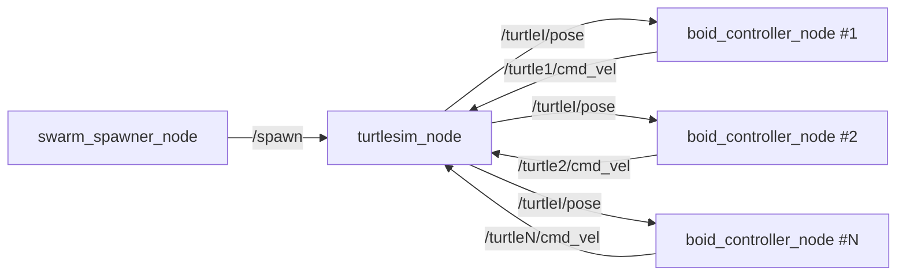
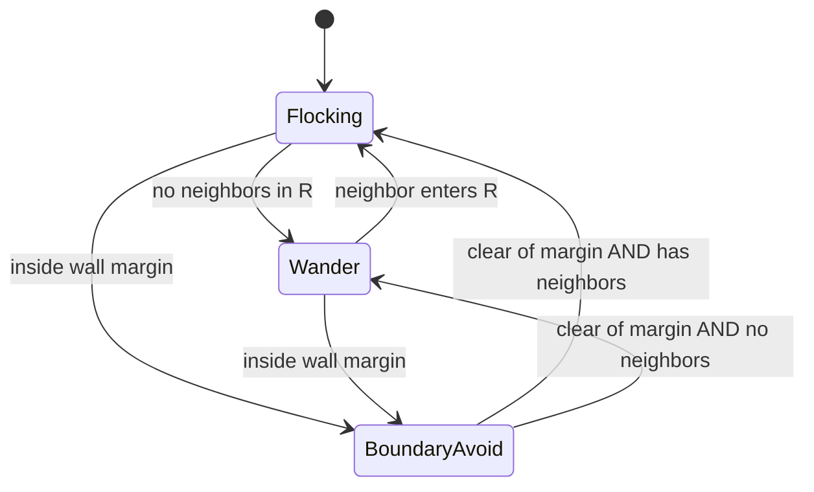

# Software Design Document (SDD) — v2
## Project: ROS 2 Turtlesim Boids Swarm Coordinator

> **Revision note (v2):** This revision reframes the "decentralized" claim around *mutual peer perception*, adds explicit **boundary avoidance** and **wander** behaviors, introduces a full **parameter / runtime-tuning** system, adds **velocity limits** (including a fix for the steering deadlock), and clarifies the **Alignment** rule that was ambiguous in v1. New sections: control-loop architecture, behavior arbitration, pseudocode, testing, and an honest "Open Design Issues" list.

---

### 1. Introduction

**1.1 Purpose**
Implement, simulate, and validate a multi-robot coordination system using the Boids (flocking) algorithm on **ROS 2** with the 2D **`turtlesim`** environment as a low-cost sandbox, prior to migrating to higher-fidelity simulation (Gazebo) or hardware (e.g. Crazyflie / Crazyswarm2).

**1.2 Scope**
Control `N` turtle agents in `turtlesim`. Each agent perceives nearby peers and computes its own trajectory to produce collective flocking (Separation, Alignment, Cohesion), plus supporting behaviors (Boundary Avoidance, Wander) needed to keep the swarm alive inside a bounded 2D world.

**1.3 Glossary**

| Term | Meaning |
|---|---|
| **Agent / Boid** | One turtle + its controller node. |
| **Neighbor** | A peer agent within the sensing radius `R` of the current agent. |
| **Non-holonomic** | The agent cannot move sideways ("strafe"); it can only drive forward/back and rotate. Its velocity direction is always its heading `θ`. |
| **Sensing radius `R`** | Perception cutoff. Peers beyond `R` are invisible this cycle. |
| **Control cycle** | One fixed-rate iteration of sense → decide → act. |

---

### 2. System Architecture

**2.1 Architectural pattern — Per-Agent Controllers with Mutual Perception**

Each agent runs its **own** `boid_controller_node` (one process per turtle, isolated by a ROS 2 namespace, e.g. `/turtle1`, `/turtle2`). There is no central brain computing movement; each agent decides for itself. This is the decentralized part.

**Perception is modeled as mutual peer sensing:** every controller subscribes to the pose streams of the other agents and builds its **own local view** of the swarm, then filters that view down to the peers inside `R`. Sensing radius enforces *behavioral* locality — an agent only reacts to nearby neighbors.

> ⚠️ **Honest caveat (see §10):** turtlesim publishes each turtle's *global, ground-truth* pose. So although behavior is local, the underlying data source is global — this is **simulated local perception**, not true onboard/relative sensing. On real hardware, relative position would come from onboard sensing or a positioning system, and range limits would be physical. Keep this gap in mind since the stated end goal is real drones.

**2.2 Core nodes**

| Node | Count | Responsibility |
|---|---|---|
| `turtlesim_node` | 1 | Simulation + rendering + turtle kinematics (provided by ROS 2). |
| `swarm_spawner_node` | 1 | Calls `/spawn` to create `N` turtles at valid random positions; optionally `/kill`s the default `turtle1`. |
| `boid_controller_node` | `N` | The Boids algorithm. One instance per turtle. Senses peers, computes desired velocity, converts to a `Twist`, publishes `cmd_vel`. |



---

### 3. Data Flow and Interfaces

**3.1 Topics (per agent namespace)**

- **Subscribes:** `/{ns}/pose` — `turtlesim/msg/Pose` — the agent's own X, Y, θ, linear & angular velocity (~62 Hz).
- **Subscribes:** `/{peer_ns}/pose` for every other active peer — used to build the neighbor cache (mutual perception).
- **Publishes:** `/{ns}/cmd_vel` — `geometry_msgs/msg/Twist` — commanded linear X and angular Z.

**3.2 Services**

- `/spawn` (`turtlesim/srv/Spawn`) — create agents.
- `/kill` (`turtlesim/srv/Kill`) — remove the default `turtle1` for a clean slate.

**3.3 Parameter interface**

All tunables (§5) are declared as ROS 2 parameters and are **runtime-reconfigurable** via `ros2 param set` or `rqt_reconfigure`. This is the primary control surface for tuning flocking behavior without restarting.

---

### 4. Component Design: The Boids Controller

**4.1 Control-loop architecture (decouple sensing from control)**

Pose messages arrive fast (≈62 Hz × `N` turtles). Do **not** run the algorithm inside the pose callback. Instead:

- **Pose callbacks** are cheap: they only write the latest pose into a cache `peer_poses[ns] = (x, y, θ, t_stamp)`.
- **A fixed-rate timer** (e.g. 10–30 Hz) runs the actual control cycle: read cache → select neighbors → compute behaviors → publish one `Twist`.

This makes the control rate deterministic and independent of message traffic, and avoids publishing `cmd_vel` faster than the sim can use.

**4.2 Sensing module (limited perception)**

Each cycle, compute the Euclidean distance from self to every cached peer. Keep peers with `distance < R` as **neighbors**. Optionally drop stale cache entries (no update within a timeout) so a crashed peer stops influencing the flock.

**4.3 Behaviors**

Each behavior returns a 2D vector in world coordinates. `p_self` is the agent's position; `p_i`, `θ_i` are a neighbor's position and heading.

**4.3.1 Separation — `V_sep`**
Repel from neighbors that are too close (closer than the minimum safe distance `d_safe`). Repulsion grows as distance shrinks:

$$\vec{V}_{sep} = \sum_{i:\, d_i < d_{safe}} \frac{\vec{p}_{self} - \vec{p}_i}{d_i^{2}}$$

Using `1/d²` (rather than `1/d`) makes very-close encounters push back hard. Separation should generally carry the **largest weight** — avoiding collisions matters more than staying in formation.

**4.3.2 Alignment — `V_align`  *(the part that was unclear — read this)***

*Goal:* steer to travel in the **same direction** as your neighbors, so the group moves as one.

*Why it's simpler than it looks in turtlesim:* the `turtlesim/msg/Pose` message gives you `theta` (heading) and `linear_velocity` — but `linear_velocity` is a **scalar speed**, not a vector. Because the turtle is **non-holonomic, its velocity direction is always exactly `theta`.** So to align headings you only need each neighbor's `θ_i`; you do not need to reconstruct any velocity vector.

*The trap — don't average angles directly.* Angles wrap around at ±π. The naive arithmetic mean of `179°` and `−179°` is `0°`, but the correct average heading is `180°`. Averaging raw angles will occasionally make an agent flip and dart the wrong way.

*The fix — average as unit vectors.* Convert each neighbor's heading to a unit vector, sum, then take the direction of the sum:

$$\vec{V}_{align} = \frac{1}{|N|}\sum_{i \in N} \big(\cos\theta_i,\; \sin\theta_i\big)$$

The direction of `V_align` is the correct mean heading; you can normalize it to unit length before weighting. (Worked check: `(cos 179°, sin 179°) + (cos −179°, sin −179°)` sums to a vector pointing at ≈`180°`. Correct.)

**4.3.3 Cohesion — `V_coh`**
Steer toward the neighborhood's center of mass:

$$\vec{c} = \frac{1}{|N|}\sum_{i \in N}\vec{p}_i, \qquad \vec{V}_{coh} = \vec{c} - \vec{p}_{self}$$

Normalize/scale so magnitude stays comparable to the other behaviors.

**4.3.4 Boundary avoidance — `V_bound`  *(new)***
Plain Boids has no walls, so agents will pile into the edges of the bounded world. Define a soft margin `m` inside configurable bounds `[x_min, x_max] × [y_min, y_max]`. When the agent enters the margin, push it back inward, proportional to how far it has intruded (turn-inward, not a hard bounce):

```
Vx_bound = 0
if x < x_min + m:  Vx_bound += (x_min + m - x) / m      # push +x (inward)
if x > x_max - m:  Vx_bound -= (x - (x_max - m)) / m     # push -x
# same pattern for y
```

Two design choices worth making explicit:
- **Enlarging the world helps but isn't a free knob in turtlesim.** The turtlesim window size is *not* a launch parameter — the rendered world is a fixed ~11×11 unit space. So a "bigger map" only truly becomes available when you migrate to Gazebo. In turtlesim, treat `[x_min..x_max]` as **controller parameters that match the sim's actual bounds**, and rely on `V_bound` to keep agents off the walls.
- Give `V_bound` a **high weight** so it overrides cohesion pulling the flock into a corner.

**4.3.5 Wander — `V_wander`  *(new)***
When an agent has **no neighbors**, Separation/Alignment/Cohesion are all zero, so it would freeze. Instead it wanders. Maintain a persistent wander heading that random-walks a little each cycle, and emit a unit vector along it:

```
wander_angle += uniform(-jitter, +jitter)         # small step each cycle
V_wander = (cos(θ + wander_angle), sin(θ + wander_angle))
```

This keeps lone agents drifting naturally until they re-encounter the flock — both more lifelike and useful for re-aggregation.

**4.4 Vector combination (weighted sum)**

$$\vec{V}_{desired} = w_{sep}\vec{V}_{sep} + w_{align}\vec{V}_{align} + w_{coh}\vec{V}_{coh} + w_{bound}\vec{V}_{bound} + w_{wander}\vec{V}_{wander}$$

Typical weight ordering: `w_bound ≥ w_sep > w_align ≈ w_coh`, with `w_wander` only active when the neighbor set is empty. All weights are parameters (§5).

**4.5 Kinematic conversion (non-holonomic) — with the deadlock fixed**

Convert `V_desired` into a `Twist`:

1. Target heading: `θ_target = atan2(Vy_desired, Vx_desired)`
2. Heading error: `e_θ = normalize(θ_target − θ_current)` into `[−π, π]`
3. Angular velocity (P-controller, clamped):
   `ω_z = clamp(Kω · e_θ, −ω_max, +ω_max)`
4. Linear velocity — **do not reverse, and don't fully stall:**
   `forward = max(0, cos(e_θ))`   ← never negative, so the agent never drives backward into a wall
   `v_x = clamp(Kv · forward · |V_desired|, v_min, v_max)`

**Why the `v1` formula could get stuck:** `v_x = Kv·cos(e_θ)·|V|` goes to ≈0 when a ~90° turn is needed and goes *negative* when the target is behind. Clamping `cos` at 0 stops reversing; a small `v_min` floor keeps the agent creeping forward so it can *rotate-while-nudging* out of a "pointing perpendicular to the goal" standstill. Set `v_min = 0` only if you actually want turn-in-place.

**4.6 Behavior arbitration (state machine)**



Boundary avoidance is effectively highest priority (via its weight); Wander is the fallback when perception is empty.

---

### 5. Parameters and Tuning

**5.1 Parameter table** (declared per controller; defaults are starting points, not tuned values)

| Parameter | Meaning | Suggested start |
|---|---|---|
| `sensing_radius` (`R`) | Neighbor cutoff distance | 3.0 |
| `safe_distance` (`d_safe`) | Separation trigger distance | 1.0 |
| `w_separation` | Separation weight | 1.5 |
| `w_alignment` | Alignment weight | 1.0 |
| `w_cohesion` | Cohesion weight | 1.0 |
| `w_boundary` | Boundary weight | 2.0 |
| `w_wander` | Wander weight (no-neighbor fallback) | 0.5 |
| `k_linear` (`Kv`) | Linear P gain | 1.0 |
| `k_angular` (`Kω`) | Angular P gain | 4.0 |
| `v_min`, `v_max` | Linear speed clamp | 0.0, 2.0 |
| `w_max` (`ω_max`) | Angular speed clamp | 5.0 |
| `bounds_min`, `bounds_max` | World box `[x,y]` | [0.5,0.5], [10.5,10.5] |
| `boundary_margin` (`m`) | Soft-wall thickness | 1.5 |
| `wander_jitter` | Max heading step/cycle | 0.3 |
| `control_rate_hz` | Control loop frequency | 20 |

**5.2 Runtime tuning mechanism**
Register `add_on_set_parameters_callback` so parameters can be changed live. Then tune while the sim runs:

```bash
ros2 param set /turtle1/boid_controller w_cohesion 0.6
# or interactively:
rqt   # → Plugins → Configuration → Dynamic Reconfigure
```

**5.3 Tuning order (these params are notoriously interdependent)**
1. Get **Separation + Boundary** stable first (no collisions, no wall-sticking).
2. Add **Cohesion** until the group clumps without collapsing to a point (if it collapses, lower `w_cohesion` or raise `d_safe`).
3. Add **Alignment** last; it's what turns a clump into a *moving* flock.
4. Only then fine-tune `Kv`, `Kω`, and the speed clamps for smooth motion.

---

### 6. Node Specifications

**6.1 `swarm_spawner_node`**
- Optionally `/kill` `turtle1`.
- Loop `N` times calling `/spawn` with random `(x, y)` **inside `[bounds_min, bounds_max]`** (respect margins so nobody spawns in a wall) and random `θ`.
- Names should match the namespace convention the controllers expect (`turtle1..turtleN`).

**6.2 `boid_controller_node` (per agent)**
- On start: declare parameters; determine own namespace; subscribe to own + peer poses; create `cmd_vel` publisher; start the control timer.
- Peer discovery can be static (from a launch arg listing peers / `N`) or dynamic (periodically scan the topic graph for `/*/pose`).
- Cache latest pose per peer; expire stale entries.

---

### 7. Control-Loop Pseudocode

```python
def on_pose(msg, ns):
    cache[ns] = Pose(msg.x, msg.y, msg.theta, now())   # cheap; sensing only

def control_cycle():                                   # fixed-rate timer
    me = cache[self_ns]
    neighbors = [p for ns, p in cache.items()
                 if ns != self_ns and dist(me, p) < R and fresh(p)]

    if neighbors:
        v = ( w_sep   * separation(me, neighbors)
            + w_align * alignment(neighbors)
            + w_coh   * cohesion(me, neighbors) )
    else:
        v = w_wander * wander(me)

    v += w_bound * boundary(me)                         # always considered

    twist = to_twist(v, me.theta)                       # §4.5 (clamped, no reverse)
    cmd_vel_pub.publish(twist)
```

---

### 8. Testing and Validation

| What to check | How | Pass criterion |
|---|---|---|
| No collisions | Log min pairwise distance each cycle | stays > small epsilon |
| No wall-sticking | Watch corners; log time spent inside margin | agents self-correct, don't pin |
| Flock forms | Visual + track group bounding-box area | area shrinks then stabilizes (doesn't collapse to 0) |
| Group moves coherently | Track variance of headings over time | heading variance decreases |
| Lone agent recovers | Spawn one far away | it wanders, then joins |
| Tuning is live | `ros2 param set` mid-run | behavior changes without restart |
| Scaling | Increase `N` | control rate holds (see §10 on O(N²)) |

Useful tools: `rqt_graph` (verify the pub/sub wiring), `ros2 topic hz /turtleX/cmd_vel` (confirm control rate), `rqt_plot` (plot heading variance / min-distance).

---

### 9. Future Extensions

1. **Obstacle avoidance:** inject static obstacle points; add an exponential repulsive `V_obs`. (Mechanically similar to `V_bound`.)
2. **Leader–follower:** teleoperate one agent as Leader; add a 4th goal rule `V_goal` pulling followers toward the Leader.
3. **3D / hardware migration:** move outputs to Gazebo or Crazyswarm2; expand vectors to `(X, Y, Z)`.
   > ⚠️ **Note the constraint change:** the §4.5 non-holonomic conversion is **turtlesim-specific**. Quadrotors like Crazyflie are (near-)holonomic in the horizontal plane — they can move in any XY direction directly — so the Boids `V_desired` can usually be commanded almost as-is, without the atan2/heading-error steering layer. Expect to **replace** §4.5 at the hardware stage. It's still worth building now as a way to understand what a Boids controller actually outputs.

---

### 10. Open Design Issues / Honest Caveats

1. **Perception is global under the hood.** turtlesim gives ground-truth global pose; locality is imposed only by `R`. This models local *behavior*, not local *sensing*. Fine for the sandbox; a real gap versus onboard-sensed drones.
2. **Subscription cost is O(N²).** `N` controllers each subscribing to `N−1` pose topics ⇒ `N(N−1)` subscriptions. Fine for the small `N` (~≤15) turtlesim comfortably renders. **Scaling option:** add a lightweight aggregator node that republishes all poses on a single `/swarm/poses` topic (a custom array message), so each controller has one subscription — slightly less "pure" but scales cleanly.
3. **World size is fixed in turtlesim.** The window/world is not a runtime parameter; boundary handling (§4.3.4) is the load-bearing solution. A genuinely larger arena only arrives with Gazebo.
4. **Parameter coupling.** The behavior weights, `R`, `d_safe`, and the gains interact strongly; expect iterative tuning (§5.3). Live reconfiguration is what makes this tractable.