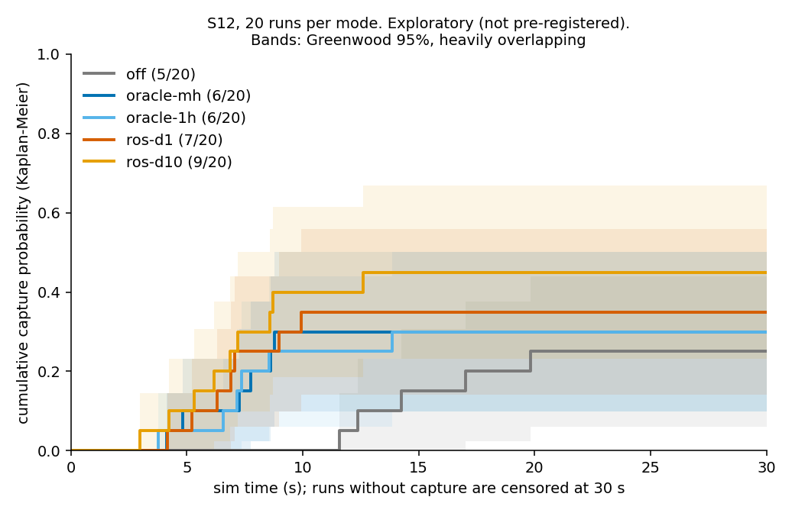
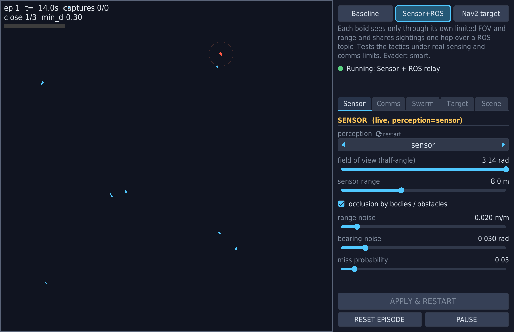

# Devlog 2026-10-08: sighting relay, Nav2 evader, one-window UI

This round was mostly about finding out which of our own results did not hold up. Every number below links to the document it comes from; anything without a source in the repository is left out. The review rounds mentioned are recorded in the [review log](../planning/review-log.md).

## Starting point

The pursuit game itself was finished: the v3 milestones M0-M6 and the v4 milestones M8-M14 were done, and the only missing piece of the v3 design was M7, a Nav2-driven evader. A phase 1 sighting relay also existed: in `perception:=sensor` mode each pursuer publishes its own noisy sighting over a ROS topic and neighbours consume it ([design](../../SDD/Sdd_distributed_sighting_relay_v1.md)). Its first evaluation was the weak point.

## The first evaluation did not hold up

A red-team review of phase 1 ([round 1](../planning/review-log.md)) upheld these findings:

- **Unfair comparison.** The simulator-side oracle shared sightings over 12 m multi-hop connectivity (`comm_range`), while the ROS path was single-hop at 8 m (`radio_range`).
- **No usable outcome.** The frozen evidence had 12 of 12 runs completing with zero captures, so there was no task-level comparison to make ([evidence](../../artifacts/sighting-relay-final-2026-10-07/README.md)).
- **Too few samples.** Three seeds, and the same seed did not reproduce the same outcome.
- **Suspicious QoS.** The shared-sighting subscription used `BEST_EFFORT` with history depth 1.
- **Overstated wording.** Calling it "decentralized" was wrong: the simulator still owns ground truth and the range gate uses simulator poses. We reworded it to a ROS one-hop transport with an application-level range gate.

## Diagnose before you sweep

The tempting move was a large sweep. A mid-point review argued against it, so we ran a small CPU-only [diagnostic](../../artifacts/sighting-relay-diagnostic-2026-10-08/README.md) with both ranges aligned to 8 m. It measured three things that shaped everything after:

1. **Self-inflicted loss.** In the same process, a depth-1 collector saw only 64-71% of the keys seen by a depth-300 collector (4 agents). The same QoS with a deeper queue received far more, so depth 1 was dropping messages by itself.
2. **A scene where nothing can be captured.** With 4 agents and a 30 s limit, 0 of 15 runs captured in any mode. With 12 agents, oracle captured 2 of 3 and ros 1 of 3.
3. **Cost and non-determinism.** A 4-agent run took about 10 s of wall time, and identical seeds gave different outcomes. So each run is an independent sample, and the seed only controls the starting layout.

We stopped sweeping and wrote a [pre-registration](../../SDD/Sdd_relay_phase2_prereg.md) instead.

## Pre-registered experiment E1

Design: two scenes (S12 with 12 agents, S4 with 4) by five modes (off, oracle multi-hop, oracle single-hop, ros depth 1, ros depth 10), 20 runs per cell in S12 and 10 in S4, Wilson intervals, and three stated hypotheses. 150 runs were executed, all valid ([E1 README](../../artifacts/relay-e1-2026-10-08/README.md)).

| Hypothesis | Verdict |
|---|---|
| H1: depth 10 drops at least 10 points fewer in-range sightings than depth 1 | Supported: 48.8% vs 1.8% (run-level bootstrap 95% CI 48.0-49.7 vs 1.3-2.4) |
| H2: capture rate ordered off <= ros <= oracle | Not claimable: S12 ranged from 5/20 (off) to 9/20 (ros depth 10), all intervals overlap |
| H3: depth 10 closer to oracle than depth 1 | Point estimates went the other way; neither supported nor refuted |

The honest reading is that we found and fixed a real transport bug, but could not show it matters for capture. A planning calculation in the E1 README says detecting 0.25 vs 0.45 capture needs about 89 runs per cell. We had 20. That n was fixed before any power analysis, which is a design mistake rather than bad luck.

A second red-team round ([round 2](../planning/review-log.md)) went after our own analysis:

- The "median capture time" was conditional on capture (survivorship), so we replaced it with a Kaplan-Meier cumulative capture curve, labelled exploratory.
- The drop rate got a run-level bootstrap interval.
- Track-valid fraction was recomputed over a fixed 5 s window, because its denominator had been tied to episode length.
- The reviewer also suspected the published numbers did not match the raw data. We cross-checked 509 agent-run records and found differences of 0 or +1, and H1 recomputed identically.

The follow-up [E1b](../../artifacts/relay-e1b-followup-2026-10-08/README.md) was explicitly not pre-registered. In real time (`time_scale` 1), depth 1 still dropped 52.3% and depth 10 dropped 0.3%, so the effect is not a fast-forward artifact. Depth 10 did not turn drops into stale rejections: 19 of 40,501 delivered events were stale. The fast-forward depth-10 drop was 7.7%, but the machine was heavily loaded, so we treat that contrast as indicative only. Because of E1 the shipped default is now depth 10.

Provenance caveats we state in the repository: the project history was squashed before publication, so the pre-registration timestamp is self-reported ([README](../../README.md)); and 149 of 150 runs carry `working_tree_dirty` because a runner path bug wrote files to the wrong directory (source was unchanged, see the E1 README).

## Nav2 on a simulator that is not Gazebo (M7)

A time-boxed [spike](../../artifacts/README.md) first checked feasibility (planning latency about 14 ms mean per request). Then we built a bridge that gives Nav2 what it expects from our pygame world: TF, odometry, an occupancy map, and the boids as a PointCloud2 obstacle source. Only the planner and controller servers run, with no behaviour-tree navigator.

The controller story is a negative result. Of seven MPPI parameter sets, only four were valid under the final harness, and none reached the 2.5 m/s target including start-up. RegulatedPurePursuit (RPP) did on open courses, so it shipped ([tuning log](../testing/nav2-mppi-tuning.md)). That log also records that the planner-margin fix which rescued RPP was never applied to MPPI, so the comparison is not like for like.

A red-team review ([round 3](../planning/review-log.md)) found that the evader trapping itself in wall pockets was not bad luck but inconsistent parameters: planner footprint 0.22 m vs a 0.15 m body, the wall drawn inside the arena, and a 0.3 m start margin smaller than wall plus radius. We fixed these, blacklisted failed goals, and enabled grid-geodesic reachability scoring. The [sanity benchmark](../../artifacts/nav2-m7-sanity/README.md) then showed plan failures falling from 45 of 103 requests to 3 of 61 and 20 of 100 in two repeats of identical code. That spread is the point: the repeats disagree more than the evaders differ, so we make no claim that Nav2 beats the reactive evader. Time-weighted, the target was in pure Nav2 mode only 9-22% of the time. We also withdrew an earlier "48/103" figure that mixed plan failures with follow aborts.

The stop-loss rule (no further tuning once the share stayed low) is in the review log. Collision detection stays off because re-enabling it caused aborts in the maze and wall starts, so the Nav2 controller still does not avoid boids by itself.

## "The evader looks dumb"

Playing the game, the evader seemed to run into walls and get caught instantly. We checked rather than assumed ([review notes](../planning/review-log.md)):

- **Wall contact is by design.** The reactive evader steers by local repulsion with no wall-escape logic. It was not a regression.
- **Instant captures were a spawn bug.** `_free_pos` drew 200 random positions and, if none was far enough from the boids, fell back to the arena centre. With 12 boids that happened for about half the seeds, so the target started surrounded and was caught in about 1 s.
- **Fix, scoped on purpose.** A safe-spawn rule and a 1.5 s capture grace apply only in the window. Headless and pre-registered runs keep the original rule so past results stay valid. The README says window results are not comparable with registered ones.

We then added a `smart` evader as a separate brain rather than altering the reactive one, and replaced its random goal sampling with a dominance-region selector: a multi-source Dijkstra arrival-time field for the evader and the pursuers, accepting a goal only when the evader's time plus a margin is less than the pursuers'. The [tuning log](../testing/smart-evader-tuning.md) lists every attempt, including ones that did not help, and two measurement mistakes (one-episode runs measured start-up timing; a wrong touch radius).

For Nav2, the evader turning on the spot was traced to RPP's rotate-to-heading behaviour, not goal pre-emption. A `smooth_start` arc replaces the head of each new path. In the non-registered [comparison](../../artifacts/evader-dominance-2026-10-08/README.md) (5 seeds), speed inside pure Nav2 mode rose from 0.31 to 2.53 m/s and plan failures fell from 24/49 to 3/43.

Limits we report: pure Nav2 mode is still only about 11% of the time because it requires the nearest pursuer to be at least 4 m away. In `obstacle_field` with 12 pursuers every evader is caught in 3-7 s, old selector and new alike, so this is a game-balance limit and not evidence of a stronger evader. In the [evader comparison](../../artifacts/evader-compare-2026-10-08/README.md) the smart evader was caught sooner than reactive in that arena (3.3 s vs 8.4 s median). Our inference, untested, is that under a hull-containment capture rule, pressing against a wall is a legitimate survival tactic.

## One window, three modes

The in-window control panel offers Baseline, Sensor + ROS relay and Nav2 target. The sim hosts a `StackSupervisor` that restarts the swarm stack in the background while the window stays open ([how it works](../../ros2_ws/src/boids_swarm/README.md)). Fields that change the stack wiring (perception, sharing mode, agent count) are staged until Apply and restart; the rest are live. A recorded golden file pins nodes and parameters so the headless launch path stays identical to before.

A trap worth recording: when the stack was launched in the background, `kill -INT` did nothing, because the child inherited an ignored SIGINT disposition. `ensure_sigint_deliverable` restores it ([review log](../planning/review-log.md)).

## Bugs found on the way to publishing

A pre-publication audit turned up:

- **Silently ignored parameters.** Several `nav2_*` parameters (selector, margin, `smooth_start` and others) were never declared, so launch values were dropped without an error. Now declared, with a test.
- **Stale test defaults.** ROS integration tests hard-coded launch defaults; they now read them from the launch file.
- **A test premise broken by a new feature.** The "unreachable goal" test assumed the selector could pick a sealed-off point. The dominance selector never does, which a new unit test confirms, so the test injects the goal through the sampled selector.
- **A dead link** in the log pointing at an ignored file.

This echoes an older lesson from the [log](../../log.md): configuration that fails silently turns into fabricated data.

## What we would do next

- Run the capture-rate comparison at roughly 90 runs per cell, as the power calculation requires.
- Fold pursuer heading into the arrival-time estimate in the dominance selector.
- Rebalance the game (obstacle density, pursuer count) so evader quality is measurable.
- Replace the application-level range gate with a real latency and loss model.
- Make Nav2's local controller aware of boids; collision detection is currently off.

Current test counts (457 unit, 23 ROS integration, collected) are in the [README](../../README.md).
