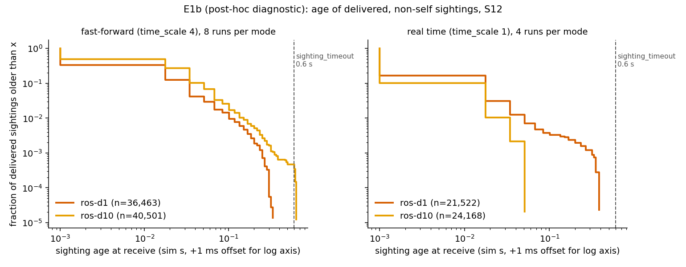

# Project history and legacy details

Moved verbatim from the pre-portfolio README (Chinese, with the relay phase 1/2 notes in English). The current overview is in [README.md](../README.md); this file is kept so no earlier content is lost. Relative links were adjusted for the docs/ location.

## 三個演進階段

專案依三份 SDD 逐步演進,每一版都建立在前一版之上:

| 版本 | 主題 | 顯示層 | 產出 |
|---|---|---|---|
| **v2** | Boids 群聚核心 | ROS 2 `turtlesim` | 分離/對齊/凝聚/邊界/漫遊 + 非完整約束運動學轉換 |
| **v3** | 協同追捕遊戲 | 自製 **pygame** 世界 | 追捕遊戲迴圈、T0–T4 策略階梯、捕獲/計分、可玩 human 模式 |
| **v4** | 感知模型、進階控制、程序化環境 | 同上 | 真實感測器模型、航跡追蹤、資訊分享、反周界戰術、程序化地圖、自適應目標 |
| **v5** | 視窗內控制面板(M15) | 同上 | 滑鼠即時改策略/大腦/模式/權重,參數扇出到 N 個 controller |

- **`boids_turtlesim/`** — v2 套件(turtlesim 群聚)
- **`boids_swarm/`** — v3–v5 主套件(pygame 世界 + 追捕遊戲 + 控制面板)

---

## 系統架構(每 agent 獨立 controller + 唯一世界擁有者)

```
        ┌─────────────────────────────┐
        │  pygame_sim_node（唯一世界）  │  物理 · 碰撞 · 捕獲 · 渲染 · 計分
        │  合成每-agent 感測 · 發 /clock │
        └──────┬───────────────┬──────┘
     pose/detections     cmd_vel │  ▲ cmd_vel
               ▼               │  │
   ┌───────────────────┐      │  │   ┌────────────────────────┐
   │ boid_controller ×N │──────┘  └───│ target_controller（逃者）│
   │ 群聚+追擊+追蹤+搜尋 │             │ reactive / adaptive 大腦 │
   └───────────────────┘             └────────────────────────┘
```

- **每個 agent 跑自己的 controller 節點**(獨立 process、獨立 namespace `/agent0..N`),沒有中央決策節點(但世界真值、碰撞、捕獲與感測合成仍由 `pygame_sim_node` 單一擁有;`oracle` 分享模式更直接使用全域真值)。
- **sim 是唯一的世界狀態擁有者**;controllers 只透過 ROS 主題溝通(pose/detections 進、cmd_vel 出)。
- sim 發布 `/clock`,controllers 用 `use_sim_time`,所以 headless 快轉基準測試仍公平可重現。

---

## 主要功能(v5 現況)

### 感知(可切 `perception:=perfect|sensor`)
- **perfect**:v3 基準,廣播全域真值(回歸用)。
- **sensor**:sim 為每個 agent 合成「牠實際看得到的」—— **視野錐 FOV**、**遮蔽 ray-cast**、**隨距離增長的雜訊**、**偵測丟失**,只發相對 range/bearing。每個 agent 各只訂閱自己的 `/agent{i}/detections`。

### 追蹤 · 搜尋 · 資訊分享
- **航跡濾波**(alpha-beta + 資料關聯):平滑雜訊、橋接丟失、從速度**導出**航向/速度。
- **搜尋**:全員看不到目標時,依 index 扇形散開掃描,直到重新捕獲。
- **資訊分享**(`comms.py`):看到目標的 agent 沿**距離限制的網狀鏈**廣播,群體因此能追蹤大多數個體看不到的目標 —— **「群體握有單一個體沒有的知識」**,個體 vs 群體的分界。

### 追捕戰術(`strategy:=`)
- 基礎階梯:`naive` / `intercept` / `pincer` / `encircle`(先包圍再收攏)/ `herd`
- 反周界(對付貼牆跑者):`counter_rotate` / `blockade`(提前堵路,最強)/ `corner_trap` / `herd_inward`
- 新隊形:`sweep`(貼牆線 cordon)/ `role_encircle`(非對稱收網)/ `bait`(誘餌開口)
- **`auto`(預設)**:每個 boid 依情境自動選策略 —— 目標繞周界→blockade、貼角落→corner_trap、開闊→encircle。
- **終端撲擊**:靠近目標時直接撲上(而非繞圈),果斷收網。

### 程序化環境(`env:=`,種子決定式)
- `obstacle_field`(**固定手工地圖** —— 12 顆大小不一的圓鋪滿整張、彼此留通道,每次都一模一樣;避障另加**切向滑過**分量讓 agent 弧線繞過障礙)、`pillar`(中央柱)、`zones`(綠=捕獲區直接贏、琥珀=焦油坑抵消速度優勢)、`shrink`(競技場邊界內縮,讓周界迴圈物理上不可能)。

### 自適應目標(`evader:=reactive|adaptive`)
- **adaptive**:效用選擇器在行為 repertoire(逃離 / 沿牆跑 / 急閃 / 穿隙 / 障礙掩護)上依威脅幾何評分,含遲滯避免抖動。與自適應追捕者形成軍備競賽。

### 視窗內控制面板(M15)
視窗右側 280px 是控制區,**跑的時候直接用滑鼠改策略與參數**,不用重開:

| 區塊 | 控制項 |
|---|---|
| PURSUIT | strategy(13 種循環)、`w_pursuit`、`commit_distance`、`ring_radius_start` |
| TARGET | evader(reactive↔adaptive)、速度倍率、轉向率、stamina |
| GAME | capture_mode(hull/escape_blocked/tag)、`d_capture`、ai↔human |
| WORLD / VIEW | 軌跡、comms mesh |
| | RESET EPISODE(重開本回合,**不會灌水回合數**)、PAUSE |
| 唯讀 | perception、env、agent 數 —— 這三個在 launch 時決定 |

兩個設計重點:

- **面板不持有任何數值**(immediate mode):每幀去問 ROS 參數現值再畫。所以你用滑鼠改、跟在另一個終端下 `ros2 param set`,兩邊永遠一致。
- `pursuit_strategy` 其實住在 **N 個獨立的 controller 行程**上,面板改一次 = N 個 `SetParameters` service call。這些呼叫**排進佇列、由 executor 執行緒統一發送**(pygame 在主執行緒),同一個參數只留最新值 —— 否則拖一次滑桿會塞爆數百輪扇出。

面板需要視窗和滑鼠,所以 `headless:=true` 時自動關閉;也可以用 `ui:=false` 手動關掉。

---

## 怎麼跑

需求:**ROS 2 Jazzy** + Python 3.12 + **pygame**(顯示層,不隨 ROS 安裝)。

```bash
cd ~/boids-swarm-pursuit/ros2_ws
source /opt/ros/jazzy/setup.bash

# 依賴(pygame 一定要裝,否則 pygame_sim 一啟動就 ModuleNotFoundError)
sudo apt install python3-pygame
#   或讓 rosdep 依 package.xml 補齊:
#   rosdep install --from-paths src --ignore-src -y
#   沒有 sudo 的話(Ubuntu 24.04 的 PEP 668 會擋掉單純的 pip install):
#   python3 -m pip install --user --break-system-packages pygame

colcon build --symlink-install --packages-select boids_swarm
source install/setup.bash            # 每個新終端都要

# 追捕遊戲 + 控制面板(預設就有;滑鼠即時改策略/參數)
ros2 launch boids_swarm pursuit.launch.py num_agents:=12 env:=obstacle_field

# 純群聚(無目標)
ros2 launch boids_swarm flocking.launch.py num_agents:=12

# 追捕遊戲(自動選策略 + 障礙場)
ros2 launch boids_swarm pursuit.launch.py strategy:=auto env:=obstacle_field trails:=true stamina:=true

# 明顯的線形隊形
ros2 launch boids_swarm pursuit.launch.py strategy:=sweep env:=pillar trails:=true

# 感測模型 + 資訊分享(窄 FOV 最能看出群體共知)
ros2 launch boids_swarm pursuit.launch.py perception:=sensor strategy:=auto

# 你親自當高速目標(方向鍵,↑ 衝刺)
ros2 launch boids_swarm pursuit.launch.py game_mode:=human strategy:=blockade

# 存 PNG 逐格檢查(視窗看不清時)
ros2 launch boids_swarm pursuit.launch.py strategy:=auto env:=pillar \
    screenshot_dir:=out/frames screenshot_period:=5.0

# 無畫面基準測試(同種子、有界快轉;跑完自動退出並印 SUMMARY)
ros2 launch boids_swarm pursuit.launch.py headless:=true episodes_max:=6 \
    seed:=11 strategy:=blockade time_limit:=90.0
```

測試(純數學,**不需要 ROS 也不需要 pygame**,乾淨 clone 即可跑):

```bash
cd ros2_ws && python3 -m pytest -q      # 135 passed
```

---

## 值得一提的工程教訓(踩過的坑)

多機器人 ROS 2 控制迴圈有幾個「靜默殺手」—— 節點在跑、主題有流量,但控制品質被毀:

1. **`rclpy.spin_once` 一次只處理一個 callback**,對 N 條 cmd_vel 會積壓成 ~330ms 致動延遲 → 每個轉向迴圈震盪。改用背景執行緒 executor + QoS depth 1。
2. **N×N pose 訂閱在 Python 到 N≈12 就把 CPU 打爆** → 改用聚合主題(v3);v4 感測模式每 agent 只訂自己那條。
3. **P 轉向控制在 ±π 邊界抖動**(延遲下永遠選不定轉向)→ 加轉向遲滯 + 期望向量 EMA。
4. **感測雜訊/丟失會再度衝擊轉向迴圈** → 靠航跡濾波吸收,raw blip 別直接進行為。
5. **共享信念是雙面刃**:全員收斂同一信念會擠成一團(對周界跑者反而更難圍)—— 正是反周界戰術要解的。

完整開發過程與 13 條坑清單見 [log.md](../log.md)。

---

## 檔案地圖

```
boids-swarm-pursuit/
├── README.md                     # 本檔(專案總覽);PROJECT.md 是它的 symlink
├── log.md                        # 三階段完整開發日誌 + 坑清單
├── presentation_script.md        # 簡報逐字稿
├── LICENSE                       # MIT
├── SDD/                          # 三份設計文件 v2/v3/v4
└── ros2_ws/
    ├── pytest.ini                # 讓單元測試在乾淨 clone 直接可跑
    └── src/
        ├── boids_turtlesim/      # v2 turtlesim 群聚
        └── boids_swarm/          # v3–v5 主套件
            ├── boids_swarm/
            │   ├── pygame_sim_node.py       # 世界:物理/渲染/感測合成/區域/收縮
            │   ├── boid_controller_node.py  # 群聚+追擊+追蹤+搜尋(每 agent)
            │   ├── target_controller_node.py# 逃者(reactive/adaptive)
            │   ├── perception.py            # 感測器模型(FOV/遮蔽/雜訊/丟失)
            │   ├── tracking.py              # 航跡濾波+關聯+繞圈偵測
            │   ├── comms.py                 # 距離限制網狀信念傳播
            │   ├── ui.py                    # 控制面板 widget(純數學,無 pygame import)
            │   ├── param_bridge.py          # 面板→N 個 controller 的參數扇出
            │   ├── world_gen.py             # 種子決定式程序化地圖
            │   ├── game.py                  # 捕獲條件+計分
            │   ├── geometry.py              # 向量/角度/運動學轉換
            │   └── behaviors/
            │       ├── flocking.py          # 分離/對齊/凝聚/邊界/漫遊/搜尋
            │       ├── pursuit.py           # 全部追捕策略 + auto + 終端撲擊
            │       ├── evasion.py           # Reactive / Adaptive
            │       ├── nav2_evader.py       # Nav2Evader (M7):目標取樣、blend、失敗回退
            │       └── escape_map.py        # M7:grid 可達性/測地距離/死巷評分
            ├── launch/                      # flocking / pursuit launch
            ├── config/params.yaml           # 所有可調參數(runtime 可改)
            └── test/                        # 純單元測試(數量見 ros2_ws/src/boids_swarm/README.md)
```

詳細指令與參數見套件的 [README](../ros2_ws/src/boids_swarm/README.md)。

## ROS sighting relay (phase 1)

The `sharing_mode` launch argument keeps three behaviors distinct: `legacy` follows the existing runtime `comms_enabled` setting; `off` disables sharing; `oracle` preserves the simulator's prior global-truth relay as an explicit comparison baseline; and `ros` sends one-hop `TargetSighting` messages built from each sender's noisy local sensor measurement. In `ros` mode the simulator removes the target from legacy `/agentI/detections`, and controllers publish direct observations only (they never forward relay-derived tracks). Sensor perception is required for `ros` mode.

Build with ROS Jazzy's Python explicitly selected, then source the workspace:

```bash
source /opt/ros/jazzy/setup.bash
cd ros2_ws
colcon build --symlink-install --packages-up-to boids_swarm --base-paths src --cmake-args -DPython3_EXECUTABLE=/usr/bin/python3
source install/setup.bash
ros2 launch boids_swarm pursuit.launch.py headless:=true ui:=false perception:=sensor sharing_mode:=ros num_agents:=4
```

The sender-to-receiver range gate uses simulator pose samples in the application. DDS itself can still deliver a topic to all nodes; this is an application-level simulated range, not radio emulation or a claim of fully decentralized networking. Covariance/confidence are validated and recorded for diagnostics; the current tracker does not perform covariance-weighted fusion. Episode reset uses an authoritative transient-local simulator topic. The pose feed is sampled separately, so reset/range checks are not atomic with the sensing event. The existing UI's parameter reverse-sync remains outside this phase.

The bounded CPU experiment uses the source-tree runner `ros2_ws/src/boids_swarm/tools/run_sighting_experiments.py`. Its 9-run matrix is three modes × seeds 11/23/37, followed by three seed-11 repeats for run-to-run variation. Each run stores observations, canonical local and shared sighting JSONL, relay events, status, launch output, resolved configuration and source fingerprint; the output root also contains a source snapshot. `simulation_time_observation_age_*` is derived from ROS simulation timestamps with roughly one 1/60-second simulation tick granularity; it is not wall-clock DDS latency. Receiver opportunity coverage means distinct receivers accepted at least once divided by distinct receivers with an in-range fresh opportunity, not packet delivery ratio. Coverage is N/A for modes without ROS relay opportunities. Capture outcomes are exploratory; this bounded run does not establish a strategy winner or statistical significance.

### 已知限制(2026-10-08 審查)

- `ros` 模式是「ROS 2 一跳 topic 傳輸 + 應用層範圍閘」:range gate 使用模擬器提供的 pose 與 sender 自報位置,不是完全分散式,也不是無線電模型。
- 既有實驗 `artifacts/sighting-relay-final-2026-10-07`:`oracle` 用 `comm_range` 12 m 多跳(`comms.py` 的 DSU 連通分量),`ros` 用 `radio_range` 8 m 單跳,兩者設定不一致,**不可直接比較**。
- 該實驗 12 個 run 全部在 30 秒 timeout,**零捕獲**,因此不能據此宣稱效能改善或策略勝出。
- 只有 3 個 seed(11/23/37),且同 seed 重跑不可重現。
- shared sighting topic 的 QoS 為 BEST_EFFORT、depth=1,可能漏收訊息,不能稱 100% 送達。
- **Phase 2 已以對齊 range、預先登記場景的方式重做評估,結果見下節。**

### Phase 2 結果:預先登記實驗 E1(150 runs)與事後診斷 E1b

預先登記 [`SDD/Sdd_relay_phase2_prereg.md`](../SDD/Sdd_relay_phase2_prereg.md)(實驗前 commit,原文未修改;私有開發歷史,公開前已壓縮,自行宣告而非外部登記;事後補註見 [`SDD/Sdd_relay_phase2_postscript.md`](../SDD/Sdd_relay_phase2_postscript.md));完整數字、偏離與限制見 [E1 README](../artifacts/relay-e1-2026-10-08/README.md)。條件:12 或 4 agents、`comm_range = radio_range = 8 m`、30 秒、每次 run 為獨立樣本(seed 不保證可重現)。

- **H1(預先登記判準)成立:** shared sighting QoS `BEST_EFFORT depth=1` 自造的 per-receiver 丟包率約 49%(S12,run 層級 bootstrap 95% CI 48.0–49.7%),depth=10 降到約 2%(1.3–2.4%)。差距遠超 10 個百分點的判準。這是快轉(time_scale 4)下的結果。
- **捕獲率:n=20 下未偵測到差異。** S12 五種模式為 5/20、6/20、6/20、7/20、9/20(off、oracle-mh、oracle-1h、ros-d1、ros-d10),Wilson 區間全部重疊,無法排序;ros 點估計甚至高於 oracle,H3 的點估計方向與假說相反。以 0.25 vs 0.45 計,要有 80% power(α=0.05)每格約需 89 runs(連續性校正 98);所以這個實驗不能回答「丟包是否影響捕獲」。
- **累積捕獲曲線(探索性、非預登記):**[`docs/media/relay_e1_cumulative_capture.png`](media/relay_e1_cumulative_capture.png)。Kaplan–Meier、30 秒右截尾、Greenwood 95% 帶。五條曲線 30 秒終點落在 0.25–0.45 且帶重疊;off 模式第一次捕獲在 11.6 秒,分享模式在 3.0–4.2 秒,但這只是圖上的樣態,未檢定、不報 p 值。


- **E1b 事後診斷(非預登記;S12,快轉 8 runs、即時 4 runs 每格;[README](../artifacts/relay-e1b-followup-2026-10-08/README.md)):** depth=10 沒有把丟包轉成逾時拒收(ros-d10 快轉下 age 超過 0.6 s 的只佔 0.05%,其餘 cell 為 0;age p95 0.067 s vs depth=1 的 0.033 s)。depth=1 的丟包在即時下仍約 52%(快轉 56%),所以不是快轉造成的假象。depth=10 的丟包在即時約 0.3%、快轉約 7.7%,但實驗期間機器負載很高(load average 13–68),快轉與即時的差異與負載混在一起。



- 範圍限制:E1 以修正前的距離邊界執行(影響僅限距離恰為 8.0 的浮點情形,推論可忽略);oracle 與 ros 的資訊品質不同質(oracle 為真值加 0.15 jitter、無視野/遮擋限制),因此 oracle 不是 ros 的上限。

Pure tests run from the workspace so ROS-only integration tests are not collected accidentally:

```bash
cd ros2_ws
PYTEST_DISABLE_PLUGIN_AUTOLOAD=1 python3 -m pytest -q
PYTEST_DISABLE_PLUGIN_AUTOLOAD=1 python3 -m pytest src/boids_swarm/ros_test -q   # both ROS integration files, one process
```

Simulator launches need pygame importable by `/usr/bin/python3` (the interpreter ROS console scripts use). Install it with `sudo apt install python3-pygame`; if that package is unavailable, `pip install --user --break-system-packages pygame`. `scripts/quickstart.sh` checks this for you.
