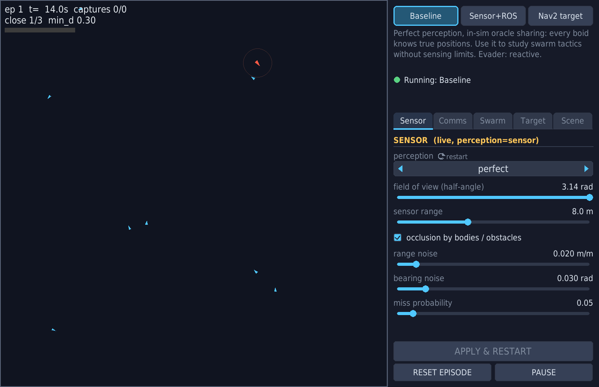
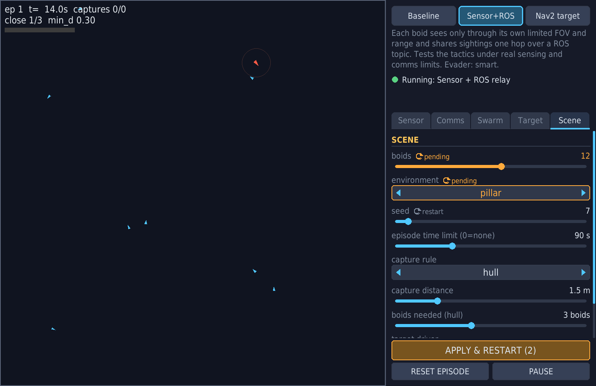
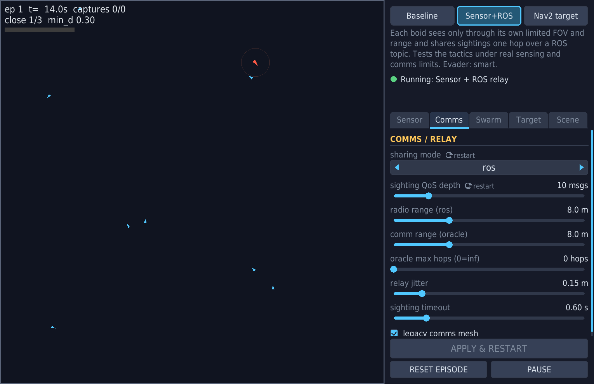
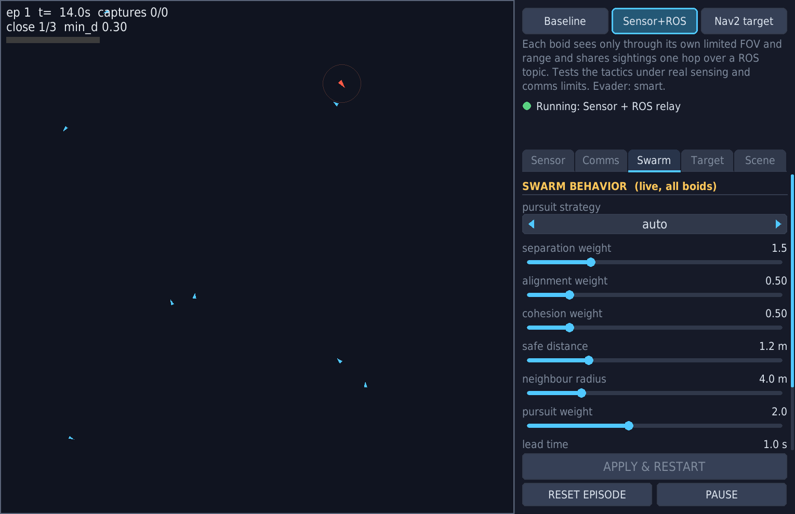
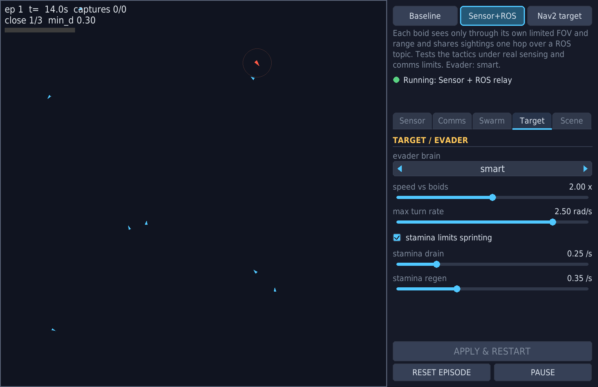
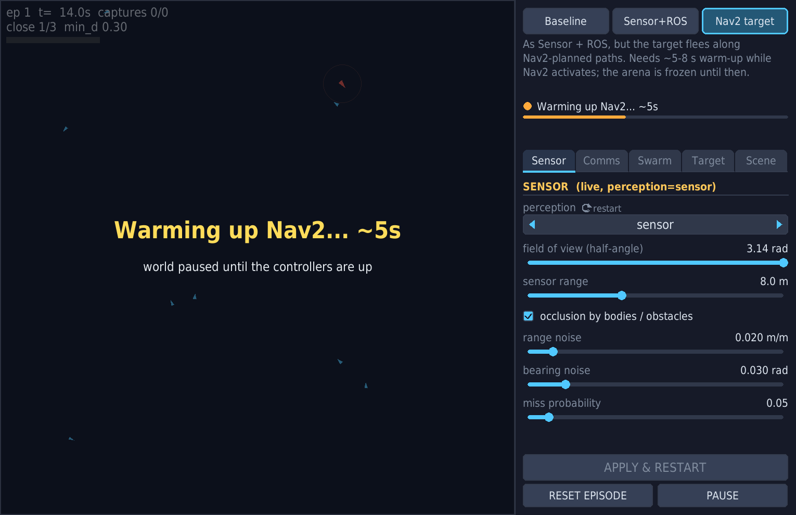

# boids_swarm

ROS 2 Boids Swarm — **Cooperative Pursuit Game** (pygame display + ROS 2 core).
Implementation of [SDD v3](../../../SDD/Sdd_boids_pursuit_v3.md) and
[SDD v4](../../../SDD/Sdd_boids_v4.md).

A swarm of `N` boids must catch a target that moves at **2× swarm speed** —
impossible for any single agent, so cooperation (prediction, flanking,
encirclement, herding) is the only winning strategy. The target is fast but
turns badly (`target_omega_max` is the balance knob).

> **Shipped balance ≠ the 2× headline.** 2× is the design ceiling and the
> `pygame_sim_node` default; `config/params.yaml` ships **1.8×**
> (`target_speed_multiplier`) because 2× plus stamina measured as
> *impossible* rather than *hard*. Likewise `target_body_radius` ships at
> 0.15 (same size as a boid), so SDD C.1's "the bigger target must detour
> around chokepoints" is **not** active — the sim default 0.7 turns it on.
> Both are one `ros2 param set` away.

## Architecture (SDD §1)

| Node | Count | Role |
|---|---|---|
| `pygame_sim` | 1 | **The world**: physics, collisions, capture, rendering, HUD, pose/`/clock` publishing |
| `boid_controller` | N | Per-agent flocking + pursuit (namespace `/agent0..N-1`) |
| `target_controller` | 1 | The evader (`ReactiveEvader` / `AdaptiveEvader` / `Nav2Evader`, M7) |
| `nav2_bridge` | 1 | M7 only: `/target/odom`, TF, `/map`, boid PointCloud2 for Nav2 |

Controllers talk to the world only via topics: `/swarm/poses`
(aggregated, one subscription per controller — the v2 §10.2 scaling fix),
`/agentI/pose` (debug), `/target/pose`, `/agentI/cmd_vel`, `/target/cmd_vel`.
The sim publishes `/clock`; controllers run with `use_sim_time` so headless
fast-forward benchmarking stays fair.

## Build & run

Requires **ROS 2 Jazzy** and **pygame** (the display layer — it does *not*
come with ROS; without it `pygame_sim` dies at import).

```bash
cd ~/boids-swarm-pursuit/ros2_ws
source /opt/ros/jazzy/setup.bash

sudo apt install python3-pygame
#   or, from package.xml: rosdep install --from-paths src --ignore-src -y

colcon build --symlink-install --packages-select boids_swarm
source install/setup.bash

# M2 — pure flocking, no target
ros2 launch boids_swarm flocking.launch.py num_agents:=12

# M3+ — the pursuit game (AI evader)
ros2 launch boids_swarm pursuit.launch.py num_agents:=12 strategy:=encircle trails:=true

# M6 — drive the 2x target yourself with arrow keys
ros2 launch boids_swarm pursuit.launch.py game_mode:=human strategy:=herd

# obstacles: "x,y,r" circles separated by ';'
ros2 launch boids_swarm pursuit.launch.py obstacles:="6,6,1.5;14,12,2"

# headless benchmark (bounded fast-forward, deterministic dt)
ros2 launch boids_swarm pursuit.launch.py headless:=true episodes_max:=6 \
    time_limit:=90.0 strategy:=naive seed:=11
```

## Pursuit strategy ladder (SDD §4.4) — `strategy:=`

| | Strategy | Idea |
|---|---|---|
| T0 | `naive` | aim at target's current position — control experiment, **loses** vs 2× |
| T1 | `intercept` | lead pursuit: aim at predicted future position |
| T2 | `pincer` | boids ahead of target loop far ahead; boids behind chase |
| T3 | `encircle` | claim angular ring slots, ring shrinks over time |
| T4 | `herd` | attack from the open side only → drive target into a corner → collapse ring |

Capture (SDD §4.5): `capture_mode:=hull` (default; target inside convex hull
of ≥`capture_k` boids within `d_capture`) | `escape_blocked` | `tag` (HP).

## Control panel

The window is `window_px + panel_px * ui_scale` wide: arena on the left, the
control panel on the right. `ui_scale:=1.5` (default; 1.0-2.5) scales every
font and size; the window shrinks to fit the screen and can be resized, the
arena stays square, and tab fields scroll with the mouse wheel when the
window is too short. It has three parts: a **mode bar** with a one-paragraph
explanation and a live stack status, five **tabs** of fields, and a footer
(**Apply & restart**, reset episode, pause).

```bash
ros2 launch boids_swarm pursuit.launch.py env:=obstacle_field   # panel is on by default
ros2 launch boids_swarm pursuit.launch.py ui:=false             # arena only, no panel
```



### Modes (switch inside the open window)

| Mode | perception | sharing | evader | What it is for |
|---|---|---|---|---|
| **Baseline** | perfect | legacy (in-sim oracle) | smart (reactive if the brain is not installed) | every boid knows true positions: study swarm tactics without sensing limits |
| **Sensor + ROS relay** | sensor | ros | smart (or reactive) | each boid senses only through its own FOV/range and shares sightings one hop over a ROS topic |
| **Nav2 target** | sensor | ros | nav2 | the target flees along Nav2-planned paths; ~5-8 s warm-up while Nav2 activates |

`smart` is the panel's default evader (Baseline and Sensor + ROS relay); a
headless or `ui:=false` launch still defaults to `reactive`, so experiment
runs stay reproducible, and an explicit `evader:=...` always wins. In the
`evader_compare` sanity run (not pre-registered) `smart` hugs walls less but is
captured faster in `obstacle_field`; see
[artifacts/evader-compare-2026-10-08/README.md](../../../artifacts/evader-compare-2026-10-08/README.md).

A click stops the old controllers, resets the episode and score, and starts the
new ones; the **window never closes** and the world is held (a dimmed arena with
a countdown) until the new stack is up. Status shows
`starting / warming up / running / stopping / FAILED: <reason>`; a failure
keeps the tail of the stack log (`/tmp/swarm_stack_<pid>_<n>.log`).
`sharing_mode=ros` requires `perception=sensor`; the panel moves the partner
field for you and refuses contradictory combinations. Choosing `nav2` on the
Target tab is the same as clicking the Nav2 mode. The evader list only shows
brains the installed `target_controller` can build (`TargetController.BRAINS`),
so `smart` appears exactly when that brain exists.

Scripted switching (and the integration tests) use a topic instead of a click:

```bash
ros2 topic pub --once /ui/mode_request std_msgs/msg/String "{data: sensor_ros}"
ros2 topic pub --once /ui/mode_request std_msgs/msg/String \
  '{data: "{\"mode\": \"nav2\", \"overrides\": {\"num_agents\": 6}}"}'
ros2 topic echo /ui/stack_status        # JSON: state, mode, generation, pid, ...
```

### Fields

Fields marked with the amber **restart** tag are *staged*: editing them changes
nothing until **APPLY & RESTART** (`pending` + a count on the button). Everything
else is live: a parameter call goes straight to the node(s).

| Tab | Live | Needs restart |
|---|---|---|
| **Sensor** | `fov` [rad], `sensor_range` [m], `occlusion_enabled`, `range_sigma` [m/m], `bearing_sigma` [rad], `p_miss` | `perception` |
| **Comms** | `radio_range` [m] (sim + boids), `comm_range` [m], `oracle_max_hops`, `comm_jitter` [m], `sighting_timeout` [s], legacy mesh toggle | `sharing_mode` (legacy/off/oracle/ros), `shared_sighting_qos_depth` |
| **Swarm** | `pursuit_strategy`, `w_separation`, `w_alignment`, `w_cohesion`, `safe_distance` [m], `sensing_radius` [m], `w_pursuit`, `lead_time` [s], `ring_radius_start` [m], `commit_distance` [m] (sent to all N boids) | |
| **Target** | `evader` (reactive/adaptive/smart swap live; anything involving nav2 restarts), `target_speed_multiplier` [x] and `target_omega_max` [rad/s] (set on the sim **and** `target_controller`), stamina on/drain/regen | |
| **Scene** | `episode_time_limit` [s], `capture_mode`, `d_capture` [m], `capture_k`, target driver (ai/human), trails | `num_agents`, `env`, `seed` |

`num_agents` / `env` / `seed` are applied by rebuilding the world inside the
running sim (new entity lists, layout regenerated with the same
`WorldGenerator`/`obstacles_for_env` the launch uses, so controllers and sim
get identical obstacles) plus a stack restart; no re-launch needed. Live values
you tuned are carried into the restarted controllers.



|  |  |
|---|---|
|  |  |



The pictures are produced by `tools/ui_screenshots.py` (real panel code, dummy
video driver, no stack started).

### How it works

- **Two launch files.** With the panel on (`ui:=true`, not headless),
  `pursuit.launch.py` starts only the window-owning sim. Controllers, target and
  (for nav2) the Nav2 servers are `swarm_stack.launch.py`, started by the
  sim's `StackSupervisor` in its own session / process group. `headless:=true`
  and `ui:=false` launch everything from `pursuit.launch.py` exactly as before
  (a recorded golden file in `test/golden/` pins nodes and parameters).
- **Switching** = `killpg(SIGINT)` the old group, `SIGKILL` after 6 s, wait until
  *no* process of the group is left, then start the new stack. Everything is
  polled once per frame, so the window never blocks.
- **No orphans.** `atexit`, SIGTERM/SIGHUP handling and the main loop's
  `finally` stop the stack; if the sim is `SIGKILL`ed, the stack's own parent
  watchdog shuts it down within ~1 s.
- **The panel stores nothing.** Each frame it reads the live value and draws
  that. Remote parameters (`AGENTS`/`TARGET` rows) are read from a local mirror
  which `ParamBridge` writes back **only after every addressed node confirmed**
  the change, so a rejected edit leaves the display on the real value.
- **Threading.** pygame owns the main thread; the panel only enqueues changes
  and a ROS timer on the executor thread issues the `SetParameters` calls
  (requests coalesce per parameter while dragging a slider).

Limits: Nav2's controller speed/turn limits are derived from `params.yaml` when
the Nav2 stack starts, so changing the target speed live in Nav2 mode does not
retune Nav2 until the next restart. `time_scale` only exists headless. The
panel is off when `headless:=true` (no window, no mouse).

## Live tuning

Every parameter is runtime-reconfigurable:

```bash
ros2 param set /agent3/boid_controller pursuit_strategy herd
ros2 param set /pygame_sim render_trails true
ros2 param set /pygame_sim screenshot_dir out/shots   # periodic PNGs
```

Defaults: [config/params.yaml](config/params.yaml).

## Hard-won implementation notes (read before touching the control loop)

1. **Never rely on one `rclpy.spin_once()` per frame.** It processes ONE
   callback. Against 13 cmd_vel streams the QoS queues fill ⇒ ~330 ms
   actuation delay ⇒ every steering loop oscillates and flocking dies
   (and per-frame drain loops burn the frame budget instead). The sim
   runs the executor in a background thread — callbacks only do atomic
   assignments, pygame stays in the main thread — and cmd_vel subs use
   queue depth 1 (only the latest command matters).
2. **O(N²) pose subscriptions saturate Python.** N controllers × N pose
   topics at 60 Hz pegged 12 cores. Fixed with the aggregated
   `/swarm/poses` array (SDD v2 §10.2 option) at 30 Hz.
3. **±π steering chatter.** With sensing latency, a P heading controller
   flip-flops full-left/full-right when the goal is directly behind
   (the sign of the wrapped error jitters). `to_twist` now has turn-direction
   hysteresis (`last_w`) beyond |e| > 2.6 rad.
4. **Deadband must not freeze headings.** At flock equilibrium |V|≈0 and
   `atan2` is noise. Below `v_deadband` boids stop translating but still
   rotate toward the local mean heading — otherwise alignment consensus
   never forms.
5. **Desired-vector EMA** (`v_filter_alpha`) + own-heading extrapolation by
   published ω compensate the pose-cache latency.

## Game balance (SDD §4.2) — measured

An untiring 2× target in an open arena is uncatchable by construction —
it cruises just outside `panic_distance` forever. The shipped balance uses
the SDD's own knobs:

- `target_omega_max: 1.2` (turn radius ≈ 3.3 at sprint — "fast but turns badly")
- `target_stamina_enabled: true` — the evader sprints only when a pursuer
  is within `panic_distance`, so the swarm gets closing windows
- `encircle` fans out with a distance-scaled ring (surround-then-squeeze)
  instead of tail-chasing as one clump

Benchmark (seeded, 6–4 episodes, 90–180 s limits):
`naive` ≈ 1/6 (spawn luck only, as the SDD predicts for T0);
`intercept` 2/6; `herd` 2/6; `encircle` 2/6 @90 s and **3/4 @180 s** —
possible-but-hard, per spec. Long open-field stalemates still occur;
`w_pursuit`, `panic_distance`, stamina drain/regen and `d_capture` are the
knobs to iterate live (`ros2 param set`).

## v4 — perception, advanced control, procedural worlds (M8–M14)

v4 addresses the two v3 playtest findings: the untiring 2× target survives
by hugging the perimeter (a mathematically-safe 1D loop), and perception
was unrealistic (global ground truth for everyone). New modules:
`perception.py`, `tracking.py`, `comms.py`, `world_gen.py`; new strategies
in `behaviors/pursuit.py`; adaptive target in `behaviors/evasion.py`.

**Perception model (`perception_mode:=sensor`).** The sim synthesizes each
agent's own detections — FOV cone, occlusion ray-casts, distance-growing
noise, dropout — and publishes only `/agent{i}/detections` (relative
range/bearing). `perfect` keeps the v3 broadcast as a regression baseline.

```bash
# sensor perception, narrow FOV, information sharing on
ros2 launch boids_swarm pursuit.launch.py perception:=sensor strategy:=encircle
```

**Tracking + search + comms.** Each controller runs an alpha-beta track
filter with data association (`tracking.py`), derives heading/speed from
track velocity, searches (coverage sweep) when the target is lost, and —
via the range-limited mesh (`comms.py`) — shares sightings so the *whole
swarm* tracks a target most individuals can't see.

**New tactics** (`strategy:=`): `counter_rotate`, `blockade`, `corner_trap`,
`herd_inward` (M11 anti-perimeter, on a shared circling detector); `sweep`
(wall-anchored cordon), `role_encircle` (asymmetric collapse), `bait`
(M12).

**`auto` (the default): per-boid strategy selection.** Every boid
picks its own tactic each cycle from the shared belief — `blockade` when
the target circles the perimeter, `corner_trap` when it's pinned near a
corner, `encircle` in the open — so the swarm adapts with no coordinator node (beliefs still come from simulator-synthesized sensing).

**Terminal commit (kills the orbit).** Ring/lead tactics offset their aim
from the target, so a boid that gets close used to *circle* it instead of
closing. Inside `commit_distance` the aim blends to a straight pounce, so
the net collapses decisively. Measured: `auto` **5/9** captures at avg
**3.7–6 s** vs `encircle`'s 3/9 and slower — faster and more reliable.

```bash
ros2 launch boids_swarm pursuit.launch.py strategy:=auto env:=obstacle_field stamina:=true
```

**Procedural environments** (`env:=`): `obstacle_field` (a **fixed,
hand-authored maze** — 12 varied-size circles spread across the arena with
a clear passage between every pair, identical every run; obstacle
avoidance also slides tangentially around a circle so agents arc past
smoothly), `pillar`, `zones` (capture zone = win, tar pit = nullify 2×
speed; seed-derived), `shrink` (battle-royale bounds contraction — kills
the perimeter loop).

```bash
ros2 launch boids_swarm pursuit.launch.py env:=shrink strategy:=encircle stamina:=true
ros2 launch boids_swarm pursuit.launch.py env:=zones strategy:=herd_inward
```

**Adaptive target** (`evader:=adaptive`): a utility-based selector over a
behavior repertoire (retreat / perimeter-run / juke / gap-dash / obstacle-
shield) with hysteresis — logs mode switches tied to threat geometry.

### v4 verification (measured)

| Milestone | Result |
|---|---|
| M8 sensor | FOV gates detections (omni K≈5–7 → narrow-cone K=0–3); perfect reproduces v3 |
| M9 tracking | flocking stable under noise+dropout (min-dist 0.77 vs 0.55, hvar 0.22 vs 0.12); search fans the swarm out and reacquires |
| M10 comms | belief spread **2.3/12 → 12/12** agents when comms on (the individual-vs-swarm gap) |
| M11 tactics | **blockade 7/9** vs encircle 3/9 on the same seeds (perimeter-hugging target) |
| M12 formations | sweep/role_encircle/bait run in-sim; bait captured 1/1 @6.2s |
| M13 worlds | zones render + capture-zone win + tar-pit slow; shrink squeezes to a tiny box, capture 3/4 |
| M14 adaptive | switches retreat/perimeter/juke/gap_dash by threat geometry (logged) |

Everything is gated behind toggles (`perception_mode`, `env`, `evader`,
`comms_enabled`, per-sensor ablations) so v3 benchmarks stay comparable.

## Milestones (SDD v3 §7.3)

M0–M6 implemented and verified (M2 metrics: min pairwise ≈ 0.7–1.4, heading
variance → 0.03–0.08, bbox 184→17; M3+: episodes/score/HUD live; strategy
A/B via seeded headless benchmarks; M6: obstacles render/block, human mode
drives the target with arrow keys). M7 (`Nav2Evader`) is implemented — see
[Nav2 evader (M7)](#nav2-evader-m7) below.

## Nav2 evader (M7)

`evader:=nav2` replaces the target's brain with a Nav2-planned one. The
launch also starts the Nav2 stack for the target (planner + controller +
`nav2_bridge`); `evader:=reactive` (default) is unchanged and does not start
Nav2.

```
 pygame_sim ──/target/pose──► nav2_bridge ──► /map (static circles + walls)
     │  │                          │         TF map→odom→base_link, /target/odom
     │  └─/swarm/poses─────────────┴──────► /boids_cloud (PointCloud2)
     │                                          │ obstacle layer (local+global)
     │                       ┌──────────────────▼─────────────────┐
     │                       │ planner_server (navfn A*)          │
     │                       │ controller_server (RPP; MPPI opt.)│
     │                       └──▲──────────────────────┬──────────┘
     │        ComputePathToPose │ / FollowPath         │ /target/nav2_cmd_vel
     │                          │                      ▼
     │              ┌───────────┴───────────────────────────────┐
     └─/swarm/poses─► target_controller (Nav2Evader)            │
                    │  every 0.75 s: sample free-space goals,    │
                    │  score (boid dist, openness, crossing,     │
                    │  grid reachability / arrival lead / pocket)│
                    │  plan + FollowPath (preempts old goal)     │
                    │  every 33 ms: heading-space blend of       │
                    │  (nav2 cmd, ReactiveEvader)                │
                    └───────────────────┬───────────────────────┘
                                        ▼  /target/cmd_vel  (sole publisher)
                          /target/evader_status  (JSON: mode, counters)
```

```bash
ros2 launch boids_swarm pursuit.launch.py evader:=nav2 env:=obstacle_field \
    num_agents:=12 strategy:=intercept headless:=true ui:=false \
    time_scale:=1.0 warmup:=8.0      # Nav2 runs on wall-clock CPU; see limits
ros2 topic echo /target/evader_status   # mode=nav2|blend|reactive + counters
```

**Goal choice.** 64 free-space candidates are scored by distance from the
nearest boid, openness, a penalty for passing boids on the way, and (with an
`EscapeMap`, a Python copy of the occupancy + inflation grid, ~13 ms per
decision) three grid terms: candidates the target cannot reach are dropped;
the *arrival lead* (the nearest boid's travel distance minus 0.6 x the
target's, both by geodesic distance, so a wall between them counts) rewards
goals the target reaches first; and for the 8 best candidates a *pocket
penalty* (floor left to keep fleeing beyond the goal, plus clearance) demotes
dead ends. These are heuristics with unit tests, not a proof of
self-trapping avoidance (see limits).

**Blend.** `w_reactive` rises linearly from 0 at `nav2_reactive_radius` to 1
at `nav2_reactive_min` (nearest boid distance). The two sources are mixed as
**velocity vectors** (Nav2's heading = the chord of its arc over 1 s,
reactive's = its desired heading) and converted back to `(v, ω)` with the
same non-holonomic law as the boids; if the vectors cancel (head-on conflict)
the reactive heading wins. Averaging `(v, ω)` directly, as before, let
opposite turns cancel into driving straight. Endpoints are the pure sources.
`mode` is `nav2` (w=0), `blend` (0<w<1) or `reactive` (w=1, *or* Nav2
unavailable: stale command, server not ready, or inside the post-failure
hold).

**Failure handling.** A failed plan, a timed-out plan (cancelled; its late
result is ignored via a sequence number) or a `FollowPath` abort is counted
(`plan_fail`, `plan_timeout`, `follow_abort`), puts the evader in pure
reactive control for `nav2_fallback_hold` seconds **without sending new
plans**, blacklists the goal for `nav2_blacklist_ttl` seconds (doubling on
repeats) within `nav2_blacklist_radius`, and drops it so the next pick is a
different goal. A preempted `FollowPath` (new goal) is not an abort.

**Parameters** (all on `target_controller`, `ros2 param set` works):
`nav2_goal_period` 0.75 s, `nav2_replan_period` 2.0 s,
`nav2_reactive_radius` 4.0 m, `nav2_reactive_min` 1.5 m,
`nav2_cmd_timeout` 0.3 s, `nav2_fallback_hold` 1.0 s, `nav2_plan_timeout`
2.0 s, `nav2_blacklist_ttl` 6 s, `nav2_blacklist_radius` 1 m. Speed/turn
limits and the costmap footprint are **derived**, never hard-coded:
`v_max = agent_max_speed × target_speed_multiplier` (3.6 m/s as shipped),
`ω_max = target_omega_max` (1.2), costmap `robot_radius =
target_body_radius` (0.15); `nav2_target.launch.py` overrides the
controller's limits and both costmaps from `params.yaml`. `target_controller`
caps the Nav2 command at the same sprint/cruise speed it uses for the
reactive evader: **2.0 m/s unless a boid is within `panic_distance` (6 m),
then 3.6 m/s** (stamina design), so in-game speed is mostly 2.0 and the
tuning harness's 2.2-3.2 m/s cruise numbers are controller capability, not
game speed.

**Obstacles.** One flat list is built in `pursuit.launch.py`
(`launch_util.obstacles_for_env`) and handed to the sim, the controllers and
(as an exactly round-tripping string) to the bridge; `ros_test` checks they
agree. Boids enter both costmaps through the obstacle layer
(`/boids_cloud`, ring of points per boid).

**Tuning, tests, evidence.** `docs/testing/nav2-mppi-tuning.md` (every
controller attempt, including failures), `ros_test/test_nav2_ros_integration.py`
(map/TF/odom on `/clock`; boids in the local **and** global costmap sampled at
the costmap's own stamp, with a negative control; obstacle course with no
boids; pocket / wall-hugging starts plan; evader fallback, blacklist and
preempt behaviour on a real Nav2 stack; launch obstacle sync), `artifacts/nav2-m7-sanity/` (small sanity
benchmark — **not** a pre-registered comparison).

**Controller.** RegulatedPurePursuit (default) won the no-boid tuning on
measured speed: 2.5-3.2 m/s cruise on the no-boid test courses (no
obstacle contact, no stall), 2.2 m/s in the `obstacle_field` maze (turn-rate
bound, inference); MPPI never exceeded
~3.0 cruise / 1.9 incl. startup. MPPI stays available:
`nav2_config:=nav2_target_mppi.yaml`. Full table and failed attempts in
`docs/testing/nav2-mppi-tuning.md`.

**Known limits.**
- RPP runs with `use_collision_detection: false` and
  `use_cost_regulated_linear_velocity_scaling: false`. Re-enabling detection
  was tried on the corrected footprint and made the maze and wall-start
  chains abort (61 "collision ahead"; data in
  `docs/testing/nav2-mppi-tuning.md`). Consequences: the local costmap has
  **no effect on the command**; a boid in RPP's arc is handled only by
  global replanning (2 Hz costmap update, plan period 0.75-2 s) and the
  reactive blend, so Nav2 itself is not a fast obstacle avoider.
- At 0.1 m resolution a body touching an obstacle is often an inscribed
  cell; the planner start is moved to the nearest traversable cell, and
  paths may graze obstacles (one maze chain came within 0.01 m).
- The target must pivot at `target_omega_max` (1.2 rad/s) before moving along
  a path that starts behind it (up to ~2.6 s); tight corners cap speed at
  ≈ ω_max·R.
- Nav2 runs in wall-clock CPU: use `time_scale:=1.0`; at the sim's default 4×
  the planner/controller cannot keep up. Activation takes ~5 s, so use
  `warmup:=` in benchmarks (until then the target is purely reactive). The
  first plan after activation can exceed `nav2_plan_timeout` (counted as a
  plan failure, its late result is dropped).
- The goal scorer's reachability / lead / pocket terms are heuristics on a
  static grid (obstacles + walls, bounds rebuilt if they change); pursuers
  are not predicted, so "arrives first" assumes they head straight for the
  goal at 0.6x the target's speed.
- Blend `reactive_radius` 4 m means the target is mostly *not* in pure Nav2
  mode against a 12-boid swarm (see the sanity README for time-weighted
  shares).
- The static map is circular obstacles + walls; shrinking arenas
  (`env:=shrink`) change the evader's grid but not Nav2's `/map`.
- Running `test_nav2_ros_integration.py` and `test_sighting_ros_integration.py`
  in **one** pytest process fails (`rclpy` is initialised twice) and can leak
  `boid_controller` processes into the ROS domain; run them separately.

## M7 acceptance status

SDD v3 M7: *"Target navigates via Nav2, routes around obstacles toward open
space, avoids self-trapping; boids appear as dynamic obstacles in its
costmap."*

| clause | status | evidence |
|---|---|---|
| navigates via Nav2 | **achieved, but Nav2 is a minority of the control time** | plan + FollowPath integration tests; in the sanity runs pure `nav2` mode is 9-22 % of the time, `blend` ~37 %, `reactive` 42-54 % (time-weighted) |
| routes around obstacles | **achieved with no boids; not with boids** | no-boid course test (no obstacle touch) and tuning harness; the controller itself does not avoid boids (collision detection stays off) |
| toward open space | **partial** | the goal scorer uses distance, openness, geodesic arrival lead on the grid (unit-tested); there is no measurement that its goals are safer than the old scorer |
| avoids self-trapping | **not achieved / not demonstrated** | the specific pocket-start plan failure is fixed and tested, the scorer rejects unreachable goals and penalises dead ends in unit tests, but sanity repeat 2 seed 6 shows the target standing in the wall pocket for ~23 s with 15 plan failures (inference: boids at the exit) |
| boids appear as dynamic obstacles in its costmap | **achieved** | integration test: boid cells are lethal in the local and global costmap at the costmap's own stamp, and absent after an empty cloud + costmap clear |

## Tests

345 unit tests pass without ROS or pygame (374 with a sourced ROS install, which adds the launch-equivalence and ParamBridge tests) in `boids_swarm/test` + `boids_turtlesim` — runnable straight from a fresh
clone (`ros2_ws/pytest.ini` puts both packages on the path):

```bash
cd ros2_ws && python3 -m pytest -q
```

Coverage: flocking, capture geometry, pursuit strategies (v3 + M11 + M12),
perception (FOV/occlusion/noise/dropout/round-trip), tracking (alpha-beta/
association/circling), comms mesh, world generation, adaptive evader,
Nav2 evader decision logic (escape-goal scoring, grid reachability/lead/pocket,
heading-space blend, goal blacklist and plan sequencing, arena wall/footprint
cost model, planner start, launch obstacle sync).

Control panel / modes: pure tests for mode mapping, supervisor state machine
(fake Popen), panel layout and staging, plus launch-equivalence checks
(`test_launch_compat.py`, needs a sourced ROS) and a real-launch integration
test (needs a built workspace; use a free `ROS_DOMAIN_ID`):

```bash
SDL_VIDEODRIVER=dummy SDL_AUDIODRIVER=dummy ROS_DOMAIN_ID=<free id> \\
  python3 -m pytest -q src/boids_swarm/ros_test/test_ui_modes_ros_integration.py
# add `-m "not slow"` to skip the Nav2 mode switch
```

M7 integration (needs a built workspace, pygame on `PYTHONPATH`, 12 tests, ~70 s,
run on its own, not together with the sighting integration file):

```bash
SDL_VIDEODRIVER=dummy SDL_AUDIODRIVER=dummy ROS_DOMAIN_ID=210 \\
  python3 -m pytest -q src/boids_swarm/ros_test/test_nav2_ros_integration.py
```

## One-hop ROS sighting relay (phase 1)

See the repository root README for mode semantics, limitations, bounded experiment evidence, and the run procedure. Build the message and application packages with the Jazzy Python interpreter explicitly selected:

```bash
source /opt/ros/jazzy/setup.bash
cd ros2_ws
colcon build --symlink-install --packages-up-to boids_swarm --base-paths src --cmake-args -DPython3_EXECUTABLE=/usr/bin/python3
source install/setup.bash
```

Headless pygame launches need pygame importable by `/usr/bin/python3` (`sudo apt install python3-pygame`, or `pip install --user --break-system-packages pygame`); the installed ROS scripts use that interpreter. Run pure tests from `ros2_ws` with `PYTEST_DISABLE_PLUGIN_AUTOLOAD=1 python3 -m pytest -q`; run the real-process ROS suite separately from the same workspace using `python3 -m pytest src/boids_swarm/ros_test -q` (both integration files share one pytest process via `ros_test/conftest.py`).

Final run-by-run evidence and collector limitations are recorded at `artifacts/sighting-relay-final-2026-10-07/README.md`.
